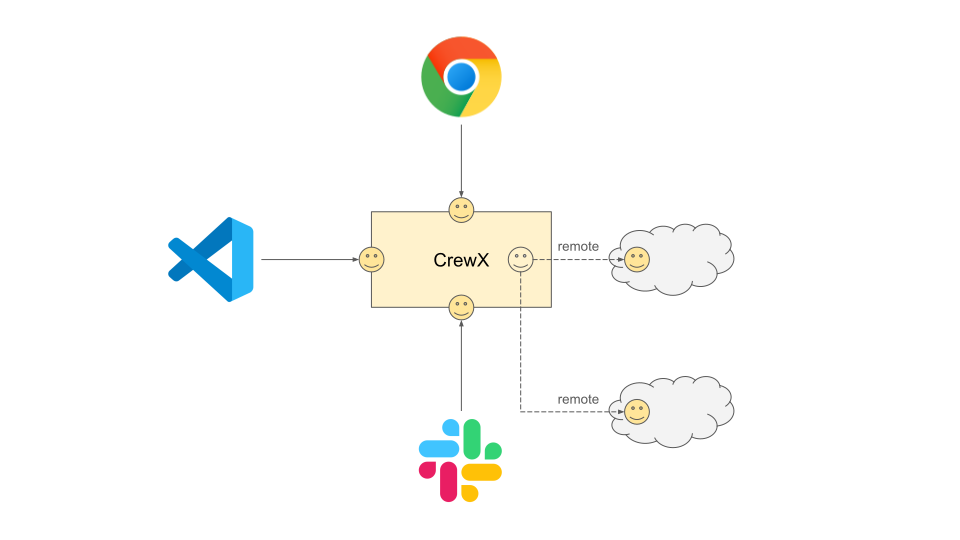

# SowonAI CrewX

> Bring Your Own AI(BYOA) team in Slack/IDE(MCP) with your existing subscriptions

Transform Claude, Gemini, Codex and Copilot into a collaborative development team. No extra costs—just your existing AI subscriptions working together.



## Why CrewX?

### **Slack Team Collaboration** - Your AI Team in Slack
Bring AI agents directly into your team's workspace:
- **Team-wide AI access** - Everyone benefits from AI expertise in Slack channels
- **Thread-based context** - Maintains conversation history automatically
- **Multi-agent collaboration** - `@claude`, `@gemini`, `@copilot` work together in real-time
- **Natural integration** - Works like chatting with team members
- **Shared knowledge** - Team learns from AI interactions, not isolated sessions

### **Remote Agents** - Distributed AI Teams
Connect and orchestrate CrewX instances across projects and servers:
- **Cross-project experts** - Frontend dev asks backend team's API specialist agent
- **Team collaboration** - Each team builds their own agents, entire org can use them
- **Expert knowledge sharing** - Ask senior's code review agent, security team's audit agent anytime
- **Separate but connected** - Each project keeps its own context, collaborate when needed

```yaml
# Access another project's specialized agents
providers:
  - id: backend_project
    type: remote
    location: "file:///workspace/backend-api/crewx.yaml"
    external_agent_id: "api_expert"

# Use their expertise in your project
crewx query "@api_expert design user authentication API"
crewx execute "@api_expert implement OAuth flow"
```

### **Plugin Provider System** - Universal AI Integration
Transform any CLI tool or AI service into an agent:
- **Bring Your Own AI** - OpenAI, Anthropic, Ollama, LiteLLM, or any AI service
- **Bring Your Own Tools** - jq, curl, ffmpeg, or any CLI tool becomes an agent
- **Bring Your Own Framework** - Integrate LangChain, CrewAI, AutoGPT seamlessly
- **No coding required** - Simple YAML configuration
- **Mix and match** - Combine different AI services in one workflow

```yaml
# Example: Add any AI service as a plugin
providers:
  - id: ollama
    type: plugin
    cli_command: ollama
    default_model: "llama3"
    query_args: ["run", "{model}"]
    prompt_in_args: false

agents:
  - id: "local_llama"
    provider: "plugin/ollama"
```

### Other Benefits
- **No additional costs** - Use existing Claude Pro, Gemini, Codex or GitHub Copilot subscriptions
- **Multi-agent collaboration** - Different AI models working on specialized tasks
- **Parallel execution** - Multiple agents working simultaneously
- **Flexible integration** - CLI, MCP server, or Slack bot

## Quick Start

```bash
# Install
npm install -g crewx

# Initialize
crewx init

# Check system
crewx doctor

# Try it out
crewx query "@claude analyze my code"
crewx execute "@claude create a login component"
```

## Three Ways to Use

### Slack Mode - Team Collaboration (Recommended)
```bash
# Start CrewX in your Slack workspace (read-only query mode)
crewx slack

# Allow agents to run execute tasks (file changes, migrations, etc.)
crewx slack --mode execute

# Your team can now:
# - @mention AI agents in channels
# - Maintain context in threads
# - Share AI insights with the whole team
```
👉 **[Complete Slack Setup Guide →](./SLACK_INSTALL.md)**

### CLI Mode - Direct terminal usage
```bash
crewx query "@claude review this code"
crewx execute "@gemini optimize performance"
crewx query "@claude @gemini @copilot compare approaches"
```

### MCP Server Mode - IDE integration
```bash
crewx mcp  # VS Code, Claude Desktop, Cursor
```

## Supported AI Tools

- **Claude Code** - Advanced reasoning and analysis
- **Gemini CLI** - Real-time web access
- **GitHub Copilot CLI** - Specialized coding assistant
- **Codex CLI** - Open inference with workspace-aware execution

## Basic Usage

```bash
# Read-only analysis
crewx query "@claude explain this function"

# File creation/modification
crewx execute "@claude implement user authentication"

# Parallel tasks
crewx execute "@claude create tests" "@gemini write docs"

# Pipeline workflows
crewx query "@architect design API" | \
crewx execute "@backend implement it"

# Thread-based conversations
crewx query "@claude design login" --thread "auth-feature"
crewx execute "@gemini implement it" --thread "auth-feature"

# Codex CLI agent
crewx query "@codex draft a release checklist"
```

Built-in CLI providers:

- `cli/claude`
- `cli/gemini`
- `cli/copilot`
- `cli/codex`

## Create Custom Agents

```bash
# Let SowonAI CrewX create agents for you
crewx execute "@crewx Create a Python expert agent"
crewx execute "@crewx Create a React specialist with TypeScript"
crewx execute "@crewx Create a DevOps agent for Docker"

# Test your new agent
crewx query "@python_expert Review my code"
```

## Agent Configuration

Create `crewx.yaml` (or `agents.yaml` for backward compatibility):

```yaml
agents:
  - id: "frontend_dev"
    name: "React Expert"
    provider: "cli/claude"  # Built-in CLI provider
    working_directory: "./src"
    inline:
      type: "agent"
      system_prompt: |
        You are a senior React developer.
        Provide detailed examples and best practices.
```

> **Note:** `crewx.yaml` is the preferred configuration file name. The legacy `agents.yaml` is still supported for backward compatibility. If both files exist, `crewx.yaml` takes priority.

## Remote Agents

Connect to other CrewX instances and delegate tasks across projects or servers.

**Quick Example:**
```bash
# Add a remote CrewX instance
providers:
  - id: backend_server
    type: remote
    location: "http://api.example.com:3000"
    external_agent_id: "backend_team"

agents:
  - id: "remote_backend"
    provider: "remote/backend_server"

# Use it like any other agent
crewx query "@remote_backend check API status"
```

**Use Cases:**
- **Project isolation** - Separate configurations for different codebases
- **Distributed teams** - Each team runs their own CrewX with specialized agents
- **Resource sharing** - Access powerful compute resources remotely
- **Multi-project coordination** - Orchestrate work across multiple projects

👉 **[Remote Agents Guide →](./docs/remote-agents.md)** for detailed setup and configuration

## Monorepo Architecture

SowonAI CrewX is structured as a monorepo with separate packages for maximum flexibility:

```
crewx/
├── packages/
│   ├── sdk/          # @sowonai/crewx-sdk (Apache-2.0)
│   │   ├── Core AI provider interfaces
│   │   ├── Conversation management
│   │   ├── Knowledge utilities
│   │   └── Agent domain types
│   └── cli/          # crewx (MIT)
│       ├── CLI implementation
│       ├── Slack integration
│       ├── MCP server
│       └── Provider implementations
├── docs/             # Comprehensive documentation
└── README.md         # This file
```

### Package Overview

| Package | License | Description | Install |
|---------|---------|-------------|---------|
| `@sowonai/crewx-sdk` | Apache-2.0 | Core SDK for building custom AI integrations | `npm install @sowonai/crewx-sdk` |
| `crewx` | MIT | Full-featured CLI tool for immediate use | `npm install -g crewx` |

**When to use what:**
- **Use `crewx` CLI** if you want to use AI agents immediately in your terminal, Slack, or IDE
- **Use `@sowonai/crewx-sdk`** if you're building custom AI tools or integrating SowonAI CrewX into your application

### SDK/CLI Integration

The SDK provides reusable components that power the CLI, enabling custom integrations:

**SDK Provides:**
- `BaseMessageFormatter` - Platform-agnostic message formatting
- `BaseAIProvider` - Extensible AI provider base class
- Built-in providers: `ClaudeProvider`, `GeminiProvider`, `CopilotProvider`, `CodexProvider`
- `RemoteAgentManager` - Remote agent communication
- `createCrewxAgent` - High-level agent factory API
- `TemplateContext` - Cross-platform template context interface (WBS-14)
- `AgentMetadata` - Agent capabilities and specialties metadata (WBS-14)

**CLI Adds:**
- NestJS integration and dependency injection
- Slack-specific formatting and bot features
- MCP server implementation
- File system operations and tool execution
- Platform-specific security and authentication

**Example - Using SDK Directly:**
```typescript
import { ClaudeProvider, RemoteAgentManager } from '@sowonai/crewx-sdk';

// Use SDK providers without CLI
const provider = new ClaudeProvider({
  apiKey: process.env.ANTHROPIC_API_KEY,
  logger: console,
});

const result = await provider.query('Analyze codebase');
```

For detailed integration patterns, see [WBS-9 Integration Guide](docs/wbs-9-phase1-5-integration.md).

### Development

```bash
# Install dependencies
npm install

# Build all packages
npm run build

# Run tests
npm test

# Build specific package
npm run build --workspace @sowonai/crewx-sdk
npm run build --workspace crewx
```

For more information, see:
- [SDK Development Guide](packages/sdk/README.md)
- [CLI Development Guide](packages/cli/README.md)
- [Build & Release Guide](BUILD.md)

## Documentation

### User Guides
- [📖 CLI Guide](docs/cli-guide.md) - Complete CLI reference
- [🔌 MCP Integration](docs/mcp-integration.md) - IDE setup and MCP servers
- [⚙️ Agent Configuration](docs/agent-configuration.md) - Custom agents and advanced config
- [🌐 Remote Agents](docs/remote-agents.md) - Connect to remote CrewX instances
- [📚 Template System](docs/templates.md) - Knowledge management and dynamic prompts for agents
- [📝 Template Variables](docs/template-variables.md) - Dynamic variables in agent configurations and TemplateContext usage (WBS-14)
- [🔧 Tool System](docs/tools.md) - Tool integration and creation guide
- [🔧 Troubleshooting](docs/troubleshooting.md) - Common issues and solutions
- [💬 Slack Integration](SLACK_INSTALL.md) - Slack bot setup

### Developer Guides
- [🏗️ SDK API Reference](packages/sdk/README.md) - Build custom integrations
- [⚙️ CLI Development](packages/cli/README.md) - CLI architecture and development
- [📦 Build & Release](BUILD.md) - Building and releasing packages
- [🔧 Development Workflow](docs/development.md) - Contributing guidelines
- [🧩 Context Integration Standard](packages/docs/context-integration-standard.md) - TemplateContext pipeline and layout responsibilities (WBS-14)
- [🛠️ Context Migration Guide](packages/docs/context-integration-migration.md) - Upgrade steps for custom agents (WBS-14)
- [🧱 Layout DSL Reference](packages/docs/layout-dsl-field-reference.md) - Layout fields, props, and helpers (WBS-14)

## License

- **SDK** (`@sowonai/crewx-sdk`): Apache-2.0 License
- **CLI** (`crewx`): MIT License

Copyright (c) 2025 SowonLabs

## Contributing

We welcome contributions! Please read our [Contributing Guide](CONTRIBUTING.md) before submitting pull requests.

For SDK contributions, please sign our [Contributor License Agreement (CLA)](docs/CLA.md).

---

Built by [SowonLabs](https://github.com/sowonlabs)
