# SowonAI CrewX

> Bring Your Own AI(BYOA) team in Slack/IDE(MCP) with your existing subscriptions
Transform Claude, Gemini, Codex and Copilot into a collaborative development team. No extra costs—just your existing AI subscriptions working together.


## Why CrewX?

### **Slack Team Collaboration** - Your AI Team in Slack
Bring AI agents directly into your team's workspace:
- **Team-wide AI access** - Everyone benefits from AI expertise in Slack channels
- **Thread-based context** - Maintains conversation history automatically
- **Multi-agent collaboration** - `@claude`, `@gemini`, `@copilot` work together in real-time
- **Natural integration** - Works like chatting with team members
- **Shared knowledge** - Team learns from AI interactions, not isolated sessions

### **Remote Agents** - Distributed AI Teams (Experimental)
Connect and orchestrate CrewX instances across projects and servers:
- **Cross-project experts** - Frontend dev asks backend team's API specialist agent
- **Team collaboration** - Each team builds their own agents, entire org can use them
- **Expert knowledge sharing** - Ask senior's code review agent, security team's audit agent anytime
- **Separate but connected** - Each project keeps its own context, collaborate when needed

```yaml
# Access another project's specialized agents
providers:
  - id: backend_project
    type: remote
    location: "file:///workspace/backend-api/crewx.yaml"
    external_agent_id: "api_expert"

# Use their expertise in your project
crewx query "@api_expert design user authentication API"
crewx execute "@api_expert implement OAuth flow"
```

### **Plugin Provider System** - Universal AI Integration
Transform any CLI tool or AI service into an agent:
- **Bring Your Own AI** - OpenAI, Anthropic, Ollama, LiteLLM, or any AI service
- **Bring Your Own Tools** - jq, curl, ffmpeg, or any CLI tool becomes an agent
- **Bring Your Own Framework** - Integrate LangChain, CrewAI, AutoGPT seamlessly
- **No coding required** - Simple YAML configuration
- **Mix and match** - Combine different AI services in one workflow

```yaml
# Example: Add any AI service as a plugin
providers:
  - id: ollama
    type: plugin
    cli_command: ollama
    default_model: "llama3"
    query_args: ["run", "{model}"]
    prompt_in_args: false

agents:
  - id: "local_llama"
    provider: "plugin/ollama"
```

### **Claude Skills Compatible** - Reusable AI Expertise
Share and reuse specialized AI capabilities using Claude Code skills format:
- **100% Claude Code compatible** - Use existing Claude skills without modification
- **Agent enhancement** - Add specialized capabilities to any agent
- **Progressive disclosure** - Skills load metadata first, content on-demand
- **Cross-agent sharing** - One skill, multiple agents
- **Simple YAML + Markdown** - Easy to create and maintain

```yaml
# Enable skills for your agents
skills:
  paths:
    - ./skills                    # Custom skill directories
  include:
    - hello                       # Specific skills to load
    - code-reviewer
    - api-designer

agents:
  - id: "senior_dev"
    provider: "cli/claude"
    skills:
      include:
        - code-reviewer           # Agent-specific skills
        - api-designer
    inline:
      prompt: |
        You are a senior developer with specialized skills.
```

**Create a skill** in `skills/hello/SKILL.md`:
```markdown
---
name: hello
description: Friendly greeting skill
version: 0.0.1
---

# Hello Skill

Use this skill to provide friendly greetings.

## Capabilities
- Generate personalized greetings
- Demonstrate skill system functionality
```

**Test across providers**:
```bash
# Test with different AI providers
CREWX_CONFIG=crewx.skills.yaml crewx query "@skill_tester_claude test hello skill"
CREWX_CONFIG=crewx.skills.yaml crewx query "@skill_tester_gemini test hello skill"
```

👉 **[Skills Documentation →](./docs/skills.md)** | **[Example Skills →](./skills/)**

### **Project Templates** - Quick Project Bootstrap
Start new projects with pre-configured templates:
- **Ready-to-use setups** - WBS automation, development workflows, deployment configs
- **Git-based templates** - Templates stored in GitHub repository
- **Simple commands** - List, preview, and initialize templates instantly
- **Customizable** - Edit downloaded templates to fit your needs

```bash
# List available templates
crewx template list

# View template details
crewx template show wbs-automation

# Initialize template in current directory
crewx template init wbs-automation
```

**Available templates:**
- `wbs-automation` - WBS task tracking with coordinator agent
- `development` - Development team setup with code review agents
- `deployment` - CI/CD deployment automation
- More templates coming soon!

👉 **[Project Templates Documentation →](./docs/project-templates.md)**

### Other Benefits
- **No additional costs** - Use existing Claude Pro, Gemini, Codex or GitHub Copilot subscriptions
- **Multi-agent collaboration** - Different AI models working on specialized tasks
- **Parallel execution** - Multiple agents working simultaneously
- **Flexible integration** - CLI, MCP server, or Slack bot

## Requirements

- **Node.js** >= 20.19.0

## Quick Start

### 🚀 One-Command Setup (Recommended)
```bash
# Interactive setup - creates crewx.yaml and helps with Slack setup
npx crewx-quickstart
```

### 📦 Manual Installation
```bash
# Install
npm install -g crewx

# Initialize
crewx init

# Check system
crewx doctor

# Try it out
crewx query "@claude analyze my code"
crewx execute "@claude create a login component"
```

## Three Ways to Use

### Slack Mode - Team Collaboration (Recommended)
```bash
# Start CrewX in your Slack workspace (read-only query mode)
crewx slack

# Allow agents to run execute tasks (file changes, migrations, etc.)
crewx slack --mode execute

# Your team can now:
# - @mention AI agents in channels
# - Maintain context in threads
# - Share AI insights with the whole team
```
👉 **[Complete Slack Setup Guide →](./SLACK_INSTALL.md)**

### CLI Mode - Direct terminal usage
```bash
crewx query "@claude review this code"
crewx execute "@gemini optimize performance"
crewx query "@claude @gemini @copilot compare approaches"
```

### MCP Server Mode - IDE integration
```bash
crewx mcp  # VS Code, Claude Desktop, Cursor
```

## Supported AI Tools

### CLI Providers (Local)
- **Claude Code** - Advanced reasoning and analysis
- **Gemini CLI** - Real-time web access
- **GitHub Copilot CLI** - Specialized coding assistant
- **Codex CLI** - Open inference with workspace-aware execution

### API Providers (Cloud & Local)
CrewX supports unified HTTP-based API providers with tool calling:

- **Ollama** (`api/ollama`)
- **OpenRouter** (`api/openai`)
- **LiteLLM** (`api/litellm`) - Planned
- **OpenAI** (`api/openai`) - Planned
- **Anthropic** (`api/anthropic`) - Planned
- **Google** (`api/google`) - Planned
- **AWS Bedrock** (`api/bedrock`) - Planned
- **SowonAI** (`api/sowonai`) - Planned

**Quick Start with API Provider:**

```yaml
# crewx.yaml
agents:
  - id: "api_assistant"
    name: "API-based Assistant"
    inline:
      type: "agent"
      provider: "api/anthropic"
      model: "claude-sonnet-4-5-20250929"
      temperature: 0.7
      options:
        query:
          tools: ["read_file", "grep", "find", "glob", "tree"]
        execute:
          tools: ["read_file", "write_file", "replace", "grep", "run_shell_command"]
      prompt: |
        You are an AI assistant with tool calling support.
```

**Key Features:**
- **Tool Calling** - Built-in tools (file operations, shell commands) + custom tools
- **MCP Integration** - Model Context Protocol for external services
- **Mode-based Filtering** - Different tool sets for query vs execute modes
- **Runtime Model Override** - Change models dynamically per request

📚 **[Complete API Provider Guide →](./docs/api-provider-guide.md)**

## Basic Usage

```bash
# Read-only analysis
crewx query "@claude explain this function"

# File creation/modification
crewx execute "@claude implement user authentication"

# Parallel tasks
crewx execute "@claude create tests" "@gemini write docs"

# Pipeline workflows
crewx query "@architect design API" | \
crewx execute "@backend implement it"

# Thread-based conversations
crewx query "@claude design login" --thread "auth-feature"
crewx execute "@gemini implement it" --thread "auth-feature"

# Codex CLI agent
crewx query "@codex draft a release checklist"
```

Built-in CLI providers:

- `cli/claude`
- `cli/gemini`
- `cli/copilot`
- `cli/codex`

## Create Custom Agents

```bash
# Let SowonAI CrewX create agents for you
crewx execute "@crewx Create a Python expert agent"
crewx execute "@crewx Create a React specialist with TypeScript"
crewx execute "@crewx Create a DevOps agent for Docker"

# Test your new agent
crewx query "@python_expert Review my code"
```

## Agent Configuration

Create `crewx.yaml` (or `agents.yaml` for backward compatibility):

```yaml
agents:
  - id: "frontend_dev"
    name: "React Expert"
    working_directory: "./src"
    inline:
      type: "agent"
      provider: "cli/claude"  # Built-in CLI provider
      prompt: |
        You are a senior React developer.
        Provide detailed examples and best practices.
```

> **Note:** `crewx.yaml` is the preferred configuration file name. The legacy `agents.yaml` is still supported for backward compatibility. If both files exist, `crewx.yaml` takes priority.

## Layout System

CrewX layouts provide reusable prompt templates that separate structure from content.

### Quick Example

```yaml
# crewx.yaml
agents:
  - id: full_agent
    inline:
      layout: "crewx/default"  # Full agent profile
      prompt: |
        You are a comprehensive assistant.

  - id: simple_agent
    inline:
      layout: "crewx/minimal"  # Lightweight wrapper
      prompt: |
        You are a simple assistant.
```

**Features:**
- 🎨 **Reusable Templates** - Share layouts across agents
- ⚛️ **Props Schema** - React PropTypes-style validation for custom layouts
- 🔧 **Built-in Layouts** - `crewx/default`, `crewx/minimal`
- 🛡️ **Security Containers** - Automatic prompt wrapping

👉 **[Layout System Guide →](./docs/layouts.md)** for detailed usage

## Remote Agents (Experimental)

Connect to other CrewX instances and delegate tasks across projects or servers.

**Quick Example:**
```bash
# Add a remote CrewX instance
providers:
  - id: backend_server
    type: remote
    location: "http://api.example.com:3000"
    external_agent_id: "backend_team"

agents:
  - id: "remote_backend"
    provider: "remote/backend_server"

# Use it like any other agent
crewx query "@remote_backend check API status"
```

**Use Cases:**
- **Project isolation** - Separate configurations for different codebases
- **Distributed teams** - Each team runs their own CrewX with specialized agents
- **Resource sharing** - Access powerful compute resources remotely
- **Multi-project coordination** - Orchestrate work across multiple projects

👉 **[Remote Agents Guide →](./docs/remote-agents.md)** for detailed setup and configuration

## Monorepo Architecture

SowonAI CrewX is structured as a monorepo with separate packages for maximum flexibility:

```
crewx/
├── packages/
│   ├── sdk/          # @sowonai/crewx-sdk (Apache-2.0)
│   │   ├── Core AI provider interfaces
│   │   ├── Conversation management
│   │   ├── Knowledge utilities
│   │   └── Agent domain types
│   └── cli/          # crewx (MIT)
│       ├── CLI implementation
│       ├── Slack integration
│       ├── MCP server
│       └── Provider implementations
├── docs/             # Comprehensive documentation
└── README.md         # This file
```

### Package Overview

| Package | License | Description | Install |
|---------|---------|-------------|---------|
| `@sowonai/crewx-sdk` | Apache-2.0 | Core SDK for building custom AI integrations | `npm install @sowonai/crewx-sdk` |
| `crewx` | MIT | Full-featured CLI tool for immediate use | `npm install -g crewx` |

**When to use what:**
- **Use `crewx` CLI** if you want to use AI agents immediately in your terminal, Slack, or IDE
- **Use `@sowonai/crewx-sdk`** if you're building custom AI tools or integrating SowonAI CrewX into your application

### SDK/CLI Integration

The SDK provides reusable components that power the CLI, enabling custom integrations:

**SDK Provides:**
- `BaseMessageFormatter` - Platform-agnostic message formatting
- `BaseAIProvider` - Extensible AI provider base class
- Built-in providers: `ClaudeProvider`, `GeminiProvider`, `CopilotProvider`, `CodexProvider`
- `RemoteAgentManager` - Remote agent communication
- `createCrewxAgent` - High-level agent factory API
- `TemplateContext` - Cross-platform template context interface
- `AgentMetadata` - Agent capabilities and specialties metadata

**CLI Adds:**
- NestJS integration and dependency injection
- Slack-specific formatting and bot features
- MCP server implementation
- File system operations and tool execution
- Platform-specific security and authentication

**Example - Using SDK Directly:**
```typescript
import { ClaudeProvider, RemoteAgentManager } from '@sowonai/crewx-sdk';

// Use SDK providers without CLI
const provider = new ClaudeProvider({
  apiKey: process.env.ANTHROPIC_API_KEY,
  logger: console,
});

const result = await provider.query('Analyze codebase');
```

### Development

```bash
# Install dependencies
npm install

# Build all packages
npm run build

# Run tests
npm test

# Build specific package
npm run build --workspace @sowonai/crewx-sdk
npm run build --workspace crewx
```

For more information, see:
- [SDK Development Guide](packages/sdk/README.md)
- [CLI Development Guide](packages/cli/README.md)
- [Build & Release Guide](BUILD.md)

## Documentation

### User Guides
- [🚀 API Provider Guide](docs/api-provider-guide.md) - **NEW!** Complete guide for API providers (OpenAI, Anthropic, Google, Bedrock, LiteLLM, Ollama, SowonAI)
- [📖 CLI Guide](docs/cli-guide.md) - Complete CLI reference
- [🔌 MCP Integration](docs/mcp-integration.md) - IDE setup and MCP servers
- [⚙️ Agent Configuration](docs/agent-configuration.md) - Custom agents and advanced config
- [🌐 Remote Agents](docs/remote-agents.md) - Connect to remote CrewX instances
- [📚 Template System](docs/templates.md) - Knowledge management and dynamic prompts for agents
- [📝 Template Variables](docs/template-variables.md) - Dynamic variables in agent configurations and TemplateContext usage
- [🎨 Layout System](docs/layouts.md) - Reusable prompt templates with React PropTypes-style props
- [🔧 Troubleshooting](docs/troubleshooting.md) - Common issues and solutions
- [💬 Slack Integration](SLACK_INSTALL.md) - Slack bot setup

### Developer Guides
- [🏗️ SDK API Reference](packages/sdk/README.md) - Build custom integrations
- [⚙️ CLI Development](packages/cli/README.md) - CLI architecture and development
- [📦 Build & Release](BUILD.md) - Building and releasing packages
- [🔧 Development Workflow](docs/development.md) - Contributing guidelines
- [🧩 Context Integration Standard](packages/docs/context-integration-standard.md) - TemplateContext pipeline and layout responsibilities
- [🛠️ Context Migration Guide](packages/docs/context-integration-migration.md) - Upgrade steps for custom agents

## License

- **SDK** (`@sowonai/crewx-sdk`): Apache-2.0 License
- **CLI** (`crewx`): MIT License

Copyright (c) 2025 SowonLabs

## Contributing

We welcome contributions! Please read our [Contributing Guide](CONTRIBUTING.md) before submitting pull requests.

For SDK contributions, please sign our [Contributor License Agreement (CLA)](docs/CLA.md).

---

Built by [SowonLabs](https://github.com/sowonlabs)

## WBS Job Management Commands

The Work Breakdown Structure (WBS) system provides comprehensive job management commands for tracking and executing project tasks efficiently.

### Job Management Commands

#### `crewx job add [options]`
**Description**: Add a new job to the WBS system  
**Usage**: `crewx job add --wbs <wbs-id> --phase <phase-number> --title <title> --description <description> [--priority <priority>] [--assignee <assignee>] [--estimation <hours>]`

**Options**:
- `--wbs <wbs-id>`: Target WBS ID (e.g., WBS-1, WBS-32)
- `--phase <phase-number>`: Phase number within the WBS
- `--title <title>`: Short job title
- `--description <description>`: Detailed job description
- `--priority <priority>`: Priority level (P0, P1, P2, P3)
- `--assignee <assignee>`: Assigned team member (@crewx_claude_dev, @crewx_gemini_dev)
- `--estimation <hours>`: Estimated completion time in hours

**Examples**:
```bash
# Add a new job to WBS-1 Phase 1
crewx job add --wbs WBS-1 --phase 1 --title "CLI Job Management" --description "Implement job add/list/update/run/next commands" --priority P0 --assignee @crewx_claude_dev --estimation 3

# Add a research job with medium priority
crewx job add --wbs WBS-28 --phase 2 --title "Provider Options Analysis" --description "Analyze provider compatibility and design unified options" --priority P1
```

#### `crewx job list [options]`
**Description**: List jobs with filtering and status tracking  
**Usage**: `crewx job list [--wbs <wbs-id>] [--assignee <assignee>] [--status <status>] [--priority <priority>]`

**Options**:
- `--wbs <wbs-id>`: Filter by specific WBS ID
- `--assignee <assignee>`: Filter by assigned team member
- `--status <status>`: Filter by status (pending, in-progress, completed, on-hold)
- `--priority <priority>`: Filter by priority level
- `--verbose`: Show detailed information including descriptions

**Examples**:
```bash
# List all pending jobs
crewx job list --status pending

# List jobs for WBS-32 assigned to @crewx_gemini_dev
crewx job list --wbs WBS-32 --assignee @crewx_gemini_dev

# List all high priority jobs with details
crewx job list --priority P0 --verbose
```

#### `crewx job update <job-id> [options]`
**Description**: Update existing job properties  
**Usage**: `crewx job update <job-id> [--status <status>] [--assignee <assignee>] [--priority <priority>] [--progress <progress>] [--notes <notes>]`

**Options**:
- `<job-id>`: Job identifier (UUID or shorthand)
- `--status <status>`: New status (pending, in-progress, completed, on-hold)
- `--assignee <assignee>`: New assignee
- `--priority <priority>`: New priority level
- `--progress <progress>`: Progress percentage (0-100)
- `--notes <notes>`: Additional notes or updates

**Examples**:
```bash
# Mark job as completed
crewx job update job-123 --status completed --progress 100 --notes "Implemented all required features"

# Reassign job to different team member
crewx job update job-456 --assignee @crewx_codex_dev --priority P1

# Update progress with notes
crewx job update job-789 --progress 75 --notes "Core implementation complete, testing in progress"
```

#### `crewx job run <job-id>`
**Description**: Execute a specific job through the WBS automation system  
**Usage**: `crewx job run <job-id> [--thread <thread-id>] [--timeout <milliseconds>]`

**Options**:
- `<job-id>`: Job identifier to execute
- `--thread <thread-id>`: Thread context ID for execution
- `--timeout <milliseconds>`: Execution timeout (default: 1800000 = 30 minutes)
- `--dry-run`: Preview what would be executed without running

**Examples**:
```bash
# Execute a specific job
crewx job run job-123

# Execute with custom thread and timeout
crewx job run job-456 --thread wbs-daily-context --timeout 3600000

# Preview execution plan
crewx job run job-789 --dry-run
```

#### `crewx job next`
**Description**: Get the next recommended job to work on based on priority, dependencies, and team availability  
**Usage**: `crewx job next [--wbs <wbs-id>] [--assignee <assignee>] [--count <count>]`

**Options**:
- `--wbs <wbs-id>`: Limit to specific WBS project
- `--assignee <assignee>`: Show jobs for specific assignee
- `--count <count>`: Number of recommended jobs (default: 3)
- `--include-ongoing`: Include currently progressing jobs

**Examples**:
```bash
# Get next 3 recommended jobs
crewx job next

# Get next job for specific WBS
crewx job next --wbs WBS-1 --count 1

# Get next jobs for specific team member
crewx job next --assignee @crewx_claude_dev
```

### WBS Integration

The job management commands integrate seamlessly with the existing WBS system:

**Automatic wbs.md Updates**:
- Job status changes automatically update the corresponding WBS entries
- Progress tracking maintains the wbs.md completion status table
- Time estimation and actual time tracking update the progress log

**Phase Coordination**:
- Jobs are organized by WBS ID and Phase number
- Dependencies between phases are automatically handled
- Parallel execution is supported for independent phases

**Thread-based Context**:
- All job executions use the thread system for context sharing
- Previous job results are available to subsequent jobs
- Cross-WBS coordination is supported through shared thread context

### Job Status Flow

```mermaid
graph LR
    A[⬜️ Pending] -->|Job add| B[🟡 In Progress]
    B -->|Job update| C[✅ Completed]
    B -->|Block| D[⏸️ On Hold]
    D -->|Resume| B
    C -->|Reopen| A
```



### Integration with CrewX Commands

The job management system works with existing CrewX commands:

```bash
# Execute jobs using existing agent commands
crewx execute "@crewx_claude_dev Execute WBS-1 job: Implement job management commands"

# Query job status
crewx query "@crewx_gemini_dev What is the current status of WBS-1 jobs?"

# Use in chat mode
crewx chat --thread wbs-context
```

### Configuration

Jobs are stored in the project structure:
- **Job definitions**: `.crewx/jobs/` directory
- **Progress tracking**: `wbs-progress.log`
- **Error tracking**: `wbs-errors.log`
- **Thread contexts**: `.crewx/threads/`

### Best Practices

1. **Use descriptive titles and detailed descriptions** for better automation
2. **Set realistic time estimations** based on AI agent capabilities
3. **Update status regularly** to maintain accurate progress tracking
4. **Use thread contexts** for jobs that need shared information
5. **Leverage parallel execution** for independent phases

### Error Handling

The job management system includes comprehensive error handling:
- **Automatic retries** for failed jobs (configurable)
- **Timeout management** with customizable limits
- **Dependency validation** before job execution
- **Rollback mechanisms** for failed complex operations

### Performance Optimization

- **Parallel execution** of independent jobs
- **Intelligent scheduling** based on priority and dependencies
- **Resource utilization monitoring** and optimization
- **Progress caching** for faster status queries
