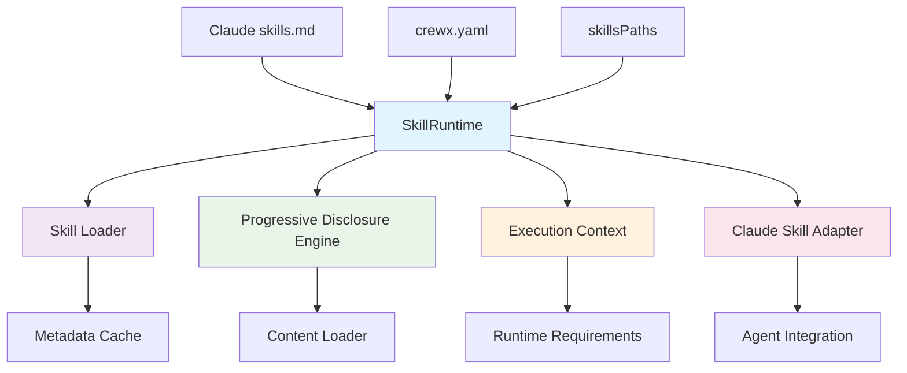
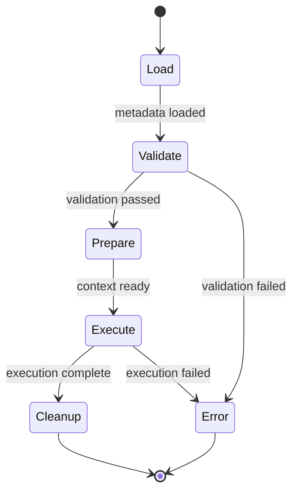

# WBS-17 Phase 1: SkillRuntime Design

## Overview

This document outlines the design for SkillRuntime - a progressive disclosure skill execution system that bridges Claude Code skills with CrewX agent capabilities.

## Architecture Overview



## 1. Progressive Disclosure Strategy

### Phase 1: Metadata-First Loading (Fast Startup)
- **Load**: YAML frontmatter (name, description, version, dependencies)
- **Skip**: Full markdown content (Role/Task/Instructions sections)
- **Cache**: Metadata in memory for rapid agent discovery

### Phase 2: Content-on-Demand (When Needed)
- **Trigger**: Agent execution or explicit skill activation
- **Load**: Full markdown content parsing
- **Merge**: Combine with CrewX agent configuration

### CrewX System Scenarios

#### CLI → SDK → Agent Flow
```typescript
// CLI Command: crewx query "@code-formatter format my-file.js"
1. CLI parses @mention → skill name "code-formatter"
2. SDK SkillRuntime discovers skill (metadata only)
3. AgentFactory creates agent with minimal context
4. On execution: Load full content, build complete prompt
5. Progressive disclosure ensures fast CLI responsiveness
```

#### Agent Configuration Flow
```typescript
// crewx.yaml with skills configuration
agents:
  - id: "developer"
    skills:
      include: ["code-formatter", "git-commit-generator"]
      exclude: ["deprecated-skill"]

1. SkillRuntime loads metadata from skillsPaths
2. Applies include/exclude filters
3. Resolves dependency graph
4. Creates skill-enhanced agent configuration
```

## 2. SkillRuntime Lifecycle

### Core Flow: Load → Validate → Prepare → Execute → Cleanup



#### Stage 1: Load (Metadata Discovery)
- **Responsibility**: Scan skill directories, parse frontmatter
- **Input**: `skillsPaths` array, `include/exclude` filters
- **Output**: Cached `SkillMetadata[]`
- **Error Handling**: Missing files, invalid YAML frontmatter

#### Stage 2: Validate (Schema & Dependency Check)
- **Responsibility**: Validate metadata, check dependencies
- **Input**: `SkillMetadata[]`, validation rules
- **Output**: `SkillValidationResult[]`
- **Error Handling**: Circular dependencies, missing dependencies

#### Stage 3: Prepare (Execution Context)
- **Responsibility**: Build execution context, resolve runtime requirements
- **Input**: Valid skills, agent configuration
- **Output**: `SkillExecutionContext`
- **Error Handling**: Runtime requirements not met

#### Stage 4: Execute (Skill Invocation)
- **Responsibility**: Execute skill with full content loaded
- **Input**: `SkillExecutionContext`, user query
- **Output**: `SkillExecutionResult`
- **Error Handling**: Skill execution failures, timeouts

#### Stage 5: Cleanup (Resource Management)
- **Responsibility**: Clean up resources, update cache
- **Input**: Execution state
- **Output**: Clean state
- **Error Handling**: Cache cleanup failures

## 3. ExecutionContext Structure

### Core Interface
```typescript
interface SkillExecutionContext {
  // Skill identification
  skillName: string;
  skillVersion: string;
  
  // Execution environment
  workingDirectory: string;
  environment: Record<string, string>;
  timeout: number;
  
  // Runtime requirements
  runtimeRequirements: {
    python?: string;
    node?: string;
    docker?: boolean;
    [key: string]: string | boolean | undefined;
  };
  
  // Skill configuration
  configuration: {
    metadata: SkillMetadata;
    content?: SkillContent;
    agentConfig: AgentDefinition;
  };
  
  // Execution options
  options: {
    validationMode: 'strict' | 'lenient';
    progressiveLoading: boolean;
    cacheEnabled: boolean;
  };
}
```

### Shared Structure (SDK/CLI)
```typescript
// SDK-specific extensions
interface SDKExecutionContext extends SkillExecutionContext {
  // Internal SDK services
  layoutLoader: LayoutLoader;
  templateContext: TemplateContext;
  
  // Agent factory
  agentFactory: AgentFactory;
}

// CLI-specific extensions
interface CLIExecutionContext extends SkillExecutionContext {
  // CLI-specific options
  cliOptions: {
    verbose?: boolean;
    dryRun?: boolean;
    debugMode?: boolean;
  };
  
  // Terminal handling
  terminal: {
    width: number;
    interactive: boolean;
  };
}
```

## 4. Claude Skill Adapter

### Adapter Responsibilities

#### 1. Metadata Extraction
```typescript
// Parse skills.md frontmatter
extractMetadata(skillFilePath: string): SkillMetadata {
  // 1. Read file
  // 2. Parse YAML frontmatter (---...---)
  // 3. Validate required fields
  // 4. Return SkillMetadata
}
```

#### 2. Content Parsing
```typescript
// Parse markdown sections
parseContent(fullContent: string): SkillContent {
  // 1. Split by ## headers
  // 2. Extract Role, Task, Instructions
  // 3. Handle markdown formatting
  // 4. Return structured content
}
```

#### 3. CrewX Mapping
```typescript
// Map Claude skill to CrewX agent
mapToCrewXAgent(skill: SkillDefinition): AgentDefinition {
  // 1. metadata.name → agent.id
  // 2. metadata.description → agent.description  
  // 3. content.role/Task/Instructions → agent.inline.system_prompt
  // 4. metadata.dependencies → agent.inline.dependencies
  // 5. metadata.runtime → agent.capabilities
}
```

### Adapter Examples

#### Simple Skill → Agent Mapping
```typescript
// Input: Claude skill (code-formatter.md)
const skill = {
  metadata: {
    name: "code-formatter",
    description: "Formats code snippets",
    version: "1.0.0",
    dependencies: []
  },
  content: {
    role: "You are a code formatting expert",
    task: "Format code according to standards",
    instructions: "1. Identify language\n2. Apply formatting\n3. Output result"
  }
};

// Output: CrewX agent configuration
const agent = {
  id: "code-formatter",
  name: "Code Formatter",
  description: "Formats code snippets",
  provider: "cli/claude",
  inline: {
    version: "1.0.0",
    system_prompt: `## Role
You are a code formatting expert

## Task  
Format code according to standards

## Instructions
1. Identify language
2. Apply formatting  
3. Output result`
  }
};
```

#### Advanced Skill with Dependencies
```typescript
// Input: Complex skill with runtime requirements
const skill = {
  metadata: {
    name: "data-analyzer",
    description: "Analyzes large datasets",
    version: "2.1.0",
    dependencies: ["python-data-libs@1.5.0"],
    runtime: {
      python: ">=3.11",
      memory: "4GB"
    }
  }
};

// Output: Enhanced CrewX agent
const agent = {
  id: "data-analyzer",
  capabilities: ["data-analysis", "python:3.11+"],
  inline: {
    version: "2.1.0",
    dependencies: ["python-data-libs"],
    system_prompt: "You are a data analysis expert...",
    runtimeRequirements: {
      python: ">=3.11",
      memory: "4GB"
    }
  }
};
```

## 5. Type Definitions (packages/sdk/src/types/)

### New Types to Add
```typescript
// skill-runtime.types.ts
export interface SkillRuntime {
  // Lifecycle methods
  loadSkills(options?: SkillLoadOptions): Promise<SkillMetadata[]>;
  validateSkill(skillName: string): Promise<SkillValidationResult>;
  prepareContext(skillName: string, agentConfig: AgentDefinition): Promise<SkillExecutionContext>;
  executeSkill(context: SkillExecutionContext, input: string): Promise<SkillExecutionResult>;
  cleanup(context: SkillExecutionContext): Promise<void>;
  
  // Discovery methods
  listAvailableSkills(): Promise<string[]>;
  resolveDependencies(skillName: string): Promise<SkillResolutionResult>;
  
  // Cache management
  clearCache(): Promise<void>;
  getCacheStats(): SkillCacheStats;
}

export interface SkillExecutionResult {
  success: boolean;
  output?: string;
  error?: Error;
  metadata: {
    executionTime: number;
    memoryUsage?: number;
    dependenciesUsed: string[];
  };
}

export interface SkillCacheStats {
  metadataCache: number;
  contentCache: number;
  totalSize: number;
  hitRate: number;
}
```

## 6. Implementation Structure

### File Organization
```
packages/sdk/src/skills/
├── runtime/
│   ├── skill-runtime.ts          # Main SkillRuntime interface
│   ├── progressive-loader.ts     # Progressive disclosure loader
│   ├── execution-context.ts      # Context management
│   └── skill-executor.ts         # Skill execution engine
├── adapter/
│   ├── claude-skill-adapter.ts   # Claude skills → CrewX adapter
│   └── crewx-mapper.ts           # Mapping logic
├── cache/
│   ├── metadata-cache.ts         # Frontmatter caching
│   └── content-cache.ts          # Full content caching
└── index.ts                      # Exports
```

## 7. Security & Sandboxing Requirements

### Input Validation
- Validate skill metadata before loading
- Sanitize user input before skill execution
- Check file path traversal attempts

### Execution Limits
- Timeout enforcement per skill
- Memory usage limits
- File system access restrictions

### Dependency Safety
- Validate dependency versions
- Check for circular dependencies
- Whitelist allowed dependencies

## 8. Error Handling Strategy

### Progressive Error Handling
```typescript
interface SkillError {
  stage: 'load' | 'validate' | 'prepare' | 'execute' | 'cleanup';
  skillName: string;
  error: Error;
  recoverable: boolean;
  suggestions: string[];
}
```

### Rollback Strategy
- Cache invalidation on errors
- Graceful degradation for missing skills
- Fallback to base agent configuration

## 9. Testing Strategy

### Unit Tests
- SkillRuntime lifecycle methods
- Progressive disclosure logic
- Claude adapter mapping

### Integration Tests  
- End-to-end skill discovery and execution
- Dependency resolution
- Cache behavior

### Performance Tests
- Startup time with many skills
- Memory usage with progressive loading
- Cache hit rates

## 10. Next Steps (Phase 2)

1. **Implementation**: Code the SkillRuntime interfaces and classes
2. **Integration**: Connect with existing AgentFactory and LayoutLoader
3. **Testing**: Implement comprehensive test suite
4. **Documentation**: Update SDK docs and examples
5. **CLI Integration**: Update CLI to use SkillRuntime for skill discovery

---

## Summary

WBS-17 Phase 1 establishes the foundation for a progressive disclosure skill runtime that:

- **Loads Fast**: Metadata-first approach ensures quick startup
- **Scales Well**: Progressive content loading handles large skill collections  
- **Integrates Seamlessly**: Bridges Claude skills with CrewX agents
- **Maintains Safety**: Robust validation and sandboxing
- **Provides Flexibility**: Extensible architecture for future registry integration

The design sets up Phase 2 for AppManifest and bundle creation, with a solid runtime foundation ready for packaging and distribution.