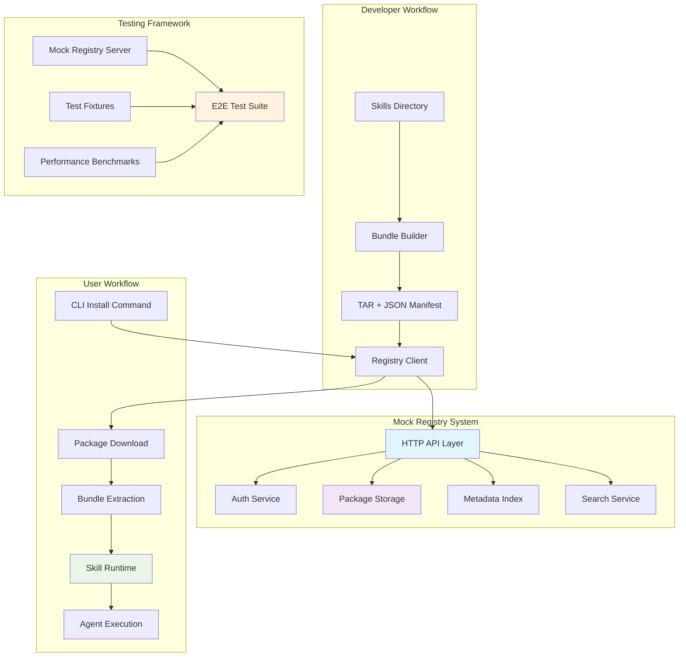

# WBS-17 Phase 3: Registry Mock & E2E Test Design

## Overview

This document outlines the complete design for Registry Mock implementation and comprehensive End-to-End (E2E) test scenarios based on the AppManifest format designed in Phase 2. The goal is to create a production-ready mock registry system that validates the complete skill packaging, distribution, and execution workflow.

## Background

- **Phase 1 Complete**: SkillRuntime architecture and progressive disclosure implemented (2025-10-20)
- **Phase 2 Complete**: AppManifest format and TAR bundle format designed (2025-10-20)
- **Phase 3 Goal**: Registry Mock implementation with complete E2E workflow validation
- **Long-term Vision**: Prepare for production skill marketplace/registry

## Architecture Overview



## Registry Mock Architecture

### 1. Core Registry Interface

```typescript
/**
 * Main registry interface that encompasses all registry operations
 */
interface ISkillRegistry {
  // Package lifecycle management
  uploadPackage(packageId: string, version: string, bundle: Buffer, options?: UploadOptions): Promise<UploadResult>;
  downloadPackage(packageId: string, version: string): Promise<Buffer>;
  deletePackage(packageId: string, version: string): Promise<void>;
  packageExists(packageId: string, version: string): Promise<boolean>;
  getPackageVersions(packageId: string): Promise<string[]>;
  
  // Metadata management
  registerPackage(manifest: AppManifest): Promise<RegistrationResult>;
  updatePackageMetadata(packageId: string, version: string, manifest: AppManifest): Promise<void>;
  getPackageInfo(packageId: string, version?: string): Promise<PackageInfo>;
  listPackages(options?: ListOptions): Promise<PackageList>;
  
  // Search and discovery
  searchPackages(query: SearchQuery): Promise<SearchResult[]>;
  getPopularPackages(limit?: number): Promise<PopularPackage[]>;
  getCategories(): Promise<Category[]>;
  
  // Dependency management
  resolveDependencies(dependencies: PackageDependency[]): Promise<ResolvedDependency[]>;
  getDependents(packageId: string): Promise<PackageReference[]>;
  validateDependencyGraph(packageId: string, version: string): Promise<DependencyValidationResult>;
  
  // Version and compatibility management
  getLatestVersion(packageId: string, constraints?: VersionConstraints): Promise<string>;
  getCompatibleVersions(packageId: string, crewxVersion: string): Promise<string[]>;
  checkCompatibility(packageId: string, version: string, environment: EnvironmentInfo): Promise<CompatibilityResult>;
  
  // Statistics and analytics
  getDownloadStats(packageId: string, version?: string, timeRange?: TimeRange): Promise<DownloadStats>;
  getUsageStats(packageId: string): Promise<UsageStats>;
  getRegistryStats(): Promise<RegistryStats>;
  
  // Security and trust
  verifyPackageSignature(packageId: string, version: string): Promise<VerificationResult>;
  getPublisherInfo(publisherId: string): Promise<PublisherInfo>;
  reportPackage(packageId: string, version: string, reason: string): Promise<void>;
  
  // Registry management
  getRegistryInfo(): Promise<RegistryInfo>;
  healthCheck(): Promise<HealthStatus>;
  migratePackage(packageId: string, fromVersion: string, toVersion: string): Promise<MigrationResult>;
}
```

### 2. In-Memory Mock Registry Implementation

```typescript
/**
 * In-memory implementation of ISkillRegistry for testing and development
 */
class MockSkillRegistry implements ISkillRegistry {
  // Core data structures
  private packages: Map<string, Map<string, PackageData>> = new Map();
  private metadata: Map<string, PackageInfo[]> = new Map();
  private users: Map<string, UserData> = new Map();
  private apiKeys: Map<string, APIKeyData> = new Map();
  private downloadStats: Map<string, Map<string, DownloadCount[]>> = new Map();
  private searchIndex: Map<string, Set<string>> = new Map(); // term -> packageIds
  private categories: Map<string, Category> = new Map();
  private publishers: Map<string, PublisherInfo> = new Map();
  private reports: Map<string, PackageReport[]> = new Map();

  constructor(config?: MockRegistryConfig) {
    this.initializeDefaultData();
  }

  // Package Storage Implementation
  async uploadPackage(
    packageId: string, 
    version: string, 
    bundle: Buffer, 
    options?: UploadOptions
  ): Promise<UploadResult> {
    // 1. Validate inputs
    this.validatePackageId(packageId);
    this.validateVersion(version);
    
    if (bundle.length === 0) {
      throw new Error('Bundle cannot be empty');
    }

    // 2. Check for existing version
    if (await this.packageExists(packageId, version)) {
      if (!options?.overwrite) {
        throw new Error(`Package ${packageId}@${version} already exists. Use overwrite option to replace.`);
      }
    }

    // 3. Validate bundle format
    const validation = await this.validateBundleFormat(bundle);
    if (!validation.valid) {
      throw new Error(`Invalid bundle format: ${validation.errors.join(', ')}`);
    }

    // 4. Extract and validate manifest
    const manifest = await this.extractManifest(bundle);
    const manifestValidation = await this.validateManifest(manifest);
    if (!manifestValidation.valid) {
      throw new Error(`Invalid manifest: ${manifestValidation.errors.join(', ')}`);
    }

    // 5. Check permissions
    if (options?.authToken) {
      const hasPermission = await this.checkUploadPermission(options.authToken, packageId);
      if (!hasPermission) {
        throw new Error('Insufficient permissions to upload this package');
      }
    }

    // 6. Store package data
    if (!this.packages.has(packageId)) {
      this.packages.set(packageId, new Map());
    }

    const packageData: PackageData = {
      packageId,
      version,
      bundle,
      manifest,
      checksum: this.calculateChecksum(bundle),
      size: bundle.length,
      uploadedAt: new Date(),
      uploadedBy: options?.authToken ? await this.getUserIdFromToken(options.authToken) : 'anonymous',
      signature: options?.signature,
      downloadCount: 0,
      lastDownloaded: null,
      verified: options?.signature ? await this.verifySignature(bundle, options.signature) : false
    };

    this.packages.get(packageId)!.set(version, packageData);

    // 7. Update metadata index
    await this.updateMetadataIndex(manifest, packageData);

    // 8. Update search index
    this.updateSearchIndex(manifest);

    // 9. Initialize download stats
    if (!this.downloadStats.has(packageId)) {
      this.downloadStats.set(packageId, new Map());
    }
    this.downloadStats.get(packageId)!.set(version, []);

    // 10. Emit events (for testing hooks)
    this.emitEvent('packageUploaded', { packageId, version, manifest });

    return {
      packageId,
      version,
      size: bundle.length,
      checksum: packageData.checksum,
      uploadedAt: packageData.uploadedAt,
      verified: packageData.verified
    };
  }

  async downloadPackage(packageId: string, version: string): Promise<Buffer> {
    // 1. Validate package exists
    const packageVersions = this.packages.get(packageId);
    if (!packageVersions) {
      throw new PackageNotFoundError(`Package ${packageId} not found`);
    }

    // 2. Resolve version (handle 'latest')
    const resolvedVersion = version === 'latest' 
      ? await this.getLatestVersion(packageId)
      : version;

    const packageData = packageVersions.get(resolvedVersion);
    if (!packageData) {
      throw new VersionNotFoundError(`Version ${resolvedVersion} of package ${packageId} not found`);
    }

    // 3. Update download statistics
    await this.updateDownloadStats(packageId, resolvedVersion);

    // 4. Emit events
    this.emitEvent('packageDownloaded', { packageId, version: resolvedVersion });

    return packageData.bundle;
  }

  // Search Implementation
  async searchPackages(query: SearchQuery): Promise<SearchResult[]> {
    const results: SearchResult[] = [];
    const queryTerms = this.extractSearchTerms(query.text);
    const candidatePackages = new Set<string>();

    // 1. Find packages matching search terms
    for (const term of queryTerms) {
      const matchingPackages = this.searchIndex.get(term.toLowerCase());
      if (matchingPackages) {
        matchingPackages.forEach(pkg => candidatePackages.add(pkg));
      }
    }

    // 2. If no text search, fall back to all packages
    if (candidatePackages.size === 0 && !query.text) {
      for (const packageId of this.packages.keys()) {
        candidatePackages.add(packageId);
      }
    }

    // 3. Score and filter candidates
    for (const packageId of candidatePackages) {
      const packageInfos = this.metadata.get(packageId);
      if (!packageInfos || packageInfos.length === 0) continue;

      const latestInfo = packageInfos[packageInfos.length - 1];
      
      // Apply filters
      if (query.category && !this.matchesCategory(latestInfo, query.category)) continue;
      if (query.author && !this.matchesAuthor(latestInfo, query.author)) continue;
      if (query.keywords && !this.matchesKeywords(latestInfo, query.keywords)) continue;
      if (query.minDownloads && latestInfo.downloadCount < query.minDownloads) continue;
      if (query.compatibility && !this.matchesCompatibility(latestInfo, query.compatibility)) continue;

      // Calculate relevance score
      const score = this.calculateRelevanceScore(latestInfo, query);
      if (score > 0) {
        results.push({
          packageId: latestInfo.id,
          name: latestInfo.name,
          description: latestInfo.description,
          version: latestInfo.version,
          author: latestInfo.author,
          keywords: latestInfo.keywords,
          downloadCount: latestInfo.downloadCount,
          updatedAt: latestInfo.updatedAt,
          category: latestInfo.category,
          score,
          verified: latestInfo.verified,
          popularity: this.calculatePopularity(latestInfo)
        });
      }
    }

    // 4. Sort results
    return results
      .sort((a, b) => {
        // Primary sort: relevance score
        if (b.score !== a.score) return b.score - a.score;
        // Secondary sort: download count
        if (b.downloadCount !== a.downloadCount) return b.downloadCount - a.downloadCount;
        // Tertiary sort: updated date
        return new Date(b.updatedAt).getTime() - new Date(a.updatedAt).getTime();
      })
      .slice(0, query.limit || 50);
  }

  // Dependency Resolution
  async resolveDependencies(dependencies: PackageDependency[]): Promise<ResolvedDependency[]> {
    const resolved: ResolvedDependency[] = [];
    const visited = new Set<string>();
    const resolving = new Set<string>();

    for (const dep of dependencies) {
      const resolvedDep = await this.resolveDependencyRecursive(dep, visited, resolving);
      resolved.push(resolvedDep);
    }

    return resolved;
  }

  private async resolveDependencyRecursive(
    dep: PackageDependency,
    visited: Set<string>,
    resolving: Set<string>
  ): Promise<ResolvedDependency> {
    const key = `${dep.packageId}@${dep.version || 'latest'}`;
    
    // Prevent infinite recursion
    if (resolving.has(key)) {
      throw new DependencyResolutionError(`Circular dependency detected: ${key}`);
    }

    if (visited.has(key)) {
      return this.getCachedResolution(key);
    }

    resolving.add(key);

    try {
      // 1. Resolve version
      const resolvedVersion = await this.resolveVersionConstraint(dep.packageId, dep.version || '*');
      
      // 2. Get package info
      const packageInfo = await this.getPackageInfo(dep.packageId, resolvedVersion);
      if (!packageInfo) {
        throw new DependencyNotFoundError(`Dependency ${dep.packageId}@${resolvedVersion} not found`);
      }

      // 3. Check compatibility
      const compatibility = await this.checkCompatibility(dep.packageId, resolvedVersion, this.getCurrentEnvironment());
      if (!compatibility.compatible) {
        throw new IncompatibleDependencyError(`Dependency ${dep.packageId}@${resolvedVersion} is incompatible: ${compatibility.reason}`);
      }

      // 4. Resolve nested dependencies
      const nestedDeps: ResolvedDependency[] = [];
      if (packageInfo.dependencies?.skills) {
        for (const nestedDep of packageInfo.dependencies.skills) {
          const resolvedNested = await this.resolveDependencyRecursive(nestedDep, visited, resolving);
          nestedDeps.push(resolvedNested);
        }
      }

      const resolved: ResolvedDependency = {
        packageId: dep.packageId,
        version: resolvedVersion,
        optional: dep.optional || false,
        resolvedAt: new Date(),
        packageInfo,
        dependencies: nestedDeps,
        downloadUrl: `${this.registryUrl}/packages/${dep.packageId}/versions/${resolvedVersion}/download`,
        checksum: await this.getPackageChecksum(dep.packageId, resolvedVersion),
        size: await this.getPackageSize(dep.packageId, resolvedVersion)
      };

      visited.add(key);
      this.cacheResolution(key, resolved);

      return resolved;

    } finally {
      resolving.delete(key);
    }
  }

  // Compatibility Checking
  async checkCompatibility(
    packageId: string, 
    version: string, 
    environment: EnvironmentInfo
  ): Promise<CompatibilityResult> {
    const packageInfo = await this.getPackageInfo(packageId, version);
    if (!packageInfo) {
      return { compatible: false, reason: 'Package not found' };
    }

    const issues: string[] = [];

    // Check CrewX version compatibility
    if (packageInfo.compatibility?.crewxVersion) {
      const crewxCompatible = this satisfiesVersionConstraint(
        environment.crewxVersion,
        packageInfo.compatibility.crewxVersion
      );
      if (!crewxCompatible) {
        issues.push(`CrewX version ${environment.crewxVersion} does not meet requirement ${packageInfo.compatibility.crewxVersion}`);
      }
    }

    // Check platform compatibility
    if (packageInfo.compatibility?.platforms) {
      if (!packageInfo.compatibility.platforms.includes(environment.platform)) {
        issues.push(`Platform ${environment.platform} not supported. Supported: ${packageInfo.compatibility.platforms.join(', ')}`);
      }
    }

    // Check architecture compatibility
    if (packageInfo.compatibility?.architectures) {
      if (!packageInfo.compatibility.architectures.includes(environment.architecture)) {
        issues.push(`Architecture ${environment.architecture} not supported. Supported: ${packageInfo.compatibility.architectures.join(', ')}`);
      }
    }

    // Check runtime requirements
    if (packageInfo.runtimeRequirements) {
      const runtimeCheck = await this.checkRuntimeRequirements(
        packageInfo.runtimeRequirements,
        environment
      );
      if (!runtimeCheck.satisfied) {
        issues.push(...runtimeCheck.issues);
      }
    }

    return {
      compatible: issues.length === 0,
      issues,
      warnings: runtimeCheck.warnings || [],
      environment: {
        ...environment,
        packageRequirements: packageInfo.runtimeRequirements,
        packageCompatibility: packageInfo.compatibility
      }
    };
  }

  // Statistics and Analytics
  async getDownloadStats(
    packageId: string, 
    version?: string, 
    timeRange?: TimeRange
  ): Promise<DownloadStats> {
    const packageStats = this.downloadStats.get(packageId);
    if (!packageStats) {
      return {
        packageId,
        totalDownloads: 0,
        versionStats: [],
        dailyStats: [],
        weeklyStats: [],
        monthlyStats: []
      };
    }

    const allVersions = version ? [version] : Array.from(packageStats.keys());
    let totalDownloads = 0;
    const versionStats: VersionDownloadStats[] = [];
    const dailyStats = new Map<string, number>();
    const weeklyStats = new Map<string, number>();
    const monthlyStats = new Map<string, number>();

    for (const ver of allVersions) {
      const versionDownloads = packageStats.get(ver) || [];
      const versionTotal = versionDownloads.reduce((sum, stat) => sum + stat.count, 0);
      totalDownloads += versionTotal;

      versionStats.push({
        version: ver,
        downloads: versionTotal,
        lastDownload: versionDownloads.length > 0 ? versionDownloads[versionDownloads.length - 1].date : null
      });

      // Aggregate by time period
      for (const stat of versionDownloads) {
        const date = new Date(stat.date);
        
        if (!timeRange || this.isInTimeRange(date, timeRange)) {
          // Daily aggregation
          const dayKey = date.toISOString().split('T')[0];
          dailyStats.set(dayKey, (dailyStats.get(dayKey) || 0) + stat.count);
          
          // Weekly aggregation
          const weekKey = this.getWeekKey(date);
          weeklyStats.set(weekKey, (weeklyStats.get(weekKey) || 0) + stat.count);
          
          // Monthly aggregation
          const monthKey = this.getMonthKey(date);
          monthlyStats.set(monthKey, (monthlyStats.get(monthKey) || 0) + stat.count);
        }
      }
    }

    return {
      packageId,
      totalDownloads,
      versionStats: versionStats.sort((a, b) => b.downloads - a.downloads),
      dailyStats: Array.from(dailyStats.entries())
        .map(([date, count]) => ({ date, count }))
        .sort((a, b) => a.date.localeCompare(b.date)),
      weeklyStats: Array.from(weeklyStats.entries())
        .map(([week, count]) => ({ week, count }))
        .sort((a, b) => a.week.localeCompare(b.week)),
      monthlyStats: Array.from(monthlyStats.entries())
        .map(([month, count]) => ({ month, count }))
        .sort((a, b) => a.month.localeCompare(b.month))
    };
  }
}
```

### 3. HTTP API Server

```typescript
/**
 * HTTP server providing REST API for the registry
 */
class RegistryHTTPServer {
  private registry: ISkillRegistry;
  private app: express.Express;
  private server: http.Server | null = null;
  private port: number;
  private authMiddleware: AuthMiddleware;
  private rateLimiter: RateLimiter;
  private corsMiddleware: CorsMiddleware;

  constructor(registry: ISkillRegistry, config: HTTPServerConfig) {
    this.registry = registry;
    this.port = config.port;
    this.app = express();
    this.authMiddleware = new AuthMiddleware(registry);
    this.rateLimiter = new RateLimiter(config.rateLimit);
    this.corsMiddleware = new CorsMiddleware(config.cors);
    
    this.setupMiddleware();
    this.setupRoutes();
    this.setupErrorHandling();
  }

  private setupMiddleware(): void {
    // Core middleware
    this.app.use(express.json({ limit: '50mb' })); // For large bundles
    this.app.use(express.urlencoded({ extended: true, limit: '50mb' }));
    this.app.use(this.corsMiddleware.handle);
    this.app.use(this.rateLimiter.handle);
    
    // Request logging
    this.app.use((req, res, next) => {
      console.log(`${new Date().toISOString()} ${req.method} ${req.path} - ${req.ip}`);
      next();
    });

    // Request ID for tracing
    this.app.use((req, res, next) => {
      req.headers['x-request-id'] = req.headers['x-request-id'] || this.generateRequestId();
      res.setHeader('X-Request-ID', req.headers['x-request-id']);
      next();
    });
  }

  private setupRoutes(): void {
    // Health and registry info
    this.app.get('/health', this.handleHealthCheck.bind(this));
    this.app.get('/registry/info', this.handleRegistryInfo.bind(this));
    
    // Authentication routes
    this.app.post('/auth/login', this.handleLogin.bind(this));
    this.app.post('/auth/refresh', this.handleRefresh.bind(this));
    this.app.post('/auth/logout', this.handleLogout.bind(this));
    
    // API key management
    this.app.post('/api-keys', this.authMiddleware.requireAuth, this.handleCreateAPIKey.bind(this));
    this.app.get('/api-keys', this.authMiddleware.requireAuth, this.handleListAPIKeys.bind(this));
    this.app.delete('/api-keys/:keyId', this.authMiddleware.requireAuth, this.handleRevokeAPIKey.bind(this));
    
    // Package operations
    this.app.post('/packages/:id/versions/:version', 
      this.authMiddleware.optionalAuth,
      this.validateUpload.bind(this),
      this.handleUpload.bind(this)
    );
    
    this.app.get('/packages/:id/versions/:version/download', 
      this.rateLimiter.downloadLimit,
      this.handleDownload.bind(this)
    );
    
    this.app.get('/packages/:id/versions', this.handleListVersions.bind(this));
    this.app.delete('/packages/:id/versions/:version', 
      this.authMiddleware.requireAuth,
      this.handleDeletePackage.bind(this)
    );
    
    // Metadata operations
    this.app.post('/packages/register', 
      this.authMiddleware.requireAuth,
      this.handleRegister.bind(this)
    );
    
    this.app.put('/packages/:id/versions/:version/metadata',
      this.authMiddleware.requireAuth,
      this.handleUpdateMetadata.bind(this)
    );
    
    this.app.get('/packages/:id', this.handleGetPackageInfo.bind(this));
    this.app.get('/packages', this.handleListPackages.bind(this));
    
    // Search and discovery
    this.app.get('/packages/search', this.handleSearch.bind(this));
    this.app.get('/packages/popular', this.handlePopularPackages.bind(this));
    this.app.get('/categories', this.handleGetCategories.bind(this));
    
    // Dependency resolution
    this.app.post('/dependencies/resolve', this.handleResolveDependencies.bind(this));
    this.app.get('/packages/:id/dependents', this.handleGetDependents.bind(this));
    this.app.post('/packages/:id/versions/:version/compatibility', this.handleCheckCompatibility.bind(this));
    
    // Statistics
    this.app.get('/packages/:id/stats/downloads', this.handleGetDownloadStats.bind(this));
    this.app.get('/packages/:id/stats/usage', this.handleGetUsageStats.bind(this));
    this.app.get('/registry/stats', this.authMiddleware.requireAuth, this.handleGetRegistryStats.bind(this));
    
    // Security and trust
    this.app.post('/packages/:id/versions/:version/verify', this.handleVerifySignature.bind(this));
    this.app.get('/publishers/:publisherId', this.handleGetPublisherInfo.bind(this));
    this.app.post('/packages/:id/versions/:version/report', this.handleReportPackage.bind(this));
    
    // Package migration
    this.app.post('/packages/:id/migrate', this.authMiddleware.requireAuth, this.handleMigratePackage.bind(this));
  }

  // Route Handlers
  private async handleUpload(req: Request, res: Response): Promise<void> {
    try {
      const { id: packageId, version } = req.params;
      const bundle = req.body; // Should be Buffer for binary upload
      
      const options: UploadOptions = {
        authToken: req.headers.authorization?.replace('Bearer ', ''),
        signature: req.headers['x-package-signature'] as string,
        overwrite: req.query.overwrite === 'true'
      };

      const result = await this.registry.uploadPackage(packageId, version, bundle, options);
      
      res.status(201).json({
        success: true,
        data: result,
        requestId: req.headers['x-request-id']
      });
      
    } catch (error) {
      this.handleError(res, error, 'package_upload');
    }
  }

  private async handleDownload(req: Request, res: Response): Promise<void> {
    try {
      const { id: packageId, version } = req.params;
      
      const bundle = await this.registry.downloadPackage(packageId, version);
      
      const packageInfo = await this.registry.getPackageInfo(packageId, version);
      const filename = `${packageId}-${version}.crewx`;
      
      res.setHeader('Content-Disposition', `attachment; filename="${filename}"`);
      res.setHeader('Content-Type', 'application/octet-stream');
      res.setHeader('Content-Length', bundle.length);
      res.setHeader('X-Package-ID', packageId);
      res.setHeader('X-Package-Version', version);
      res.setHeader('X-Package-Checksum', await this.registry.getPackageChecksum(packageId, version));
      
      res.send(bundle);
      
    } catch (error) {
      this.handleError(res, error, 'package_download');
    }
  }

  private async handleSearch(req: Request, res: Response): Promise<void> {
    try {
      const query: SearchQuery = {
        text: req.query.q as string,
        category: req.query.category as string,
        author: req.query.author as string,
        keywords: req.query.keywords ? (req.query.keywords as string).split(',') : undefined,
        limit: parseInt(req.query.limit as string) || 50,
        offset: parseInt(req.query.offset as string) || 0,
        sort: req.query.sort as 'relevance' | 'popularity' | 'updated' | 'created',
        minDownloads: parseInt(req.query.minDownloads as string),
        compatibility: req.query.compatibility as string
      };

      const results = await this.registry.searchPackages(query);
      
      res.json({
        success: true,
        data: {
          packages: results,
          total: results.length,
          query,
          requestId: req.headers['x-request-id']
        }
      });
      
    } catch (error) {
      this.handleError(res, error, 'package_search');
    }
  }

  private async handleLogin(req: Request, res: Response): Promise<void> {
    try {
      const credentials: UserCredentials = req.body;
      
      // This is a mock implementation - in production, use real authentication
      const user = await this.registry.authenticateUser(credentials);
      
      const authToken = this.generateAuthToken(user);
      
      res.json({
        success: true,
        data: {
          user: {
            id: user.id,
            username: user.username,
            email: user.email,
            publisherId: user.publisherId
          },
          token: authToken.token,
          expiresAt: authToken.expiresAt,
          refreshToken: authToken.refreshToken
        }
      });
      
    } catch (error) {
      this.handleError(res, error, 'authentication');
    }
  }

  private async handleHealthCheck(req: Request, res: Response): Promise<void> {
    try {
      const health = await this.registry.healthCheck();
      const uptime = process.uptime();
      const memory = process.memoryUsage();
      
      res.json({
        status: 'healthy',
        timestamp: new Date().toISOString(),
        uptime,
        memory: {
          rss: memory.rss,
          heapUsed: memory.heapUsed,
          heapTotal: memory.heapTotal,
          external: memory.external
        },
        registry: health,
        version: process.env.npm_package_version || '1.0.0'
      });
      
    } catch (error) {
      res.status(503).json({
        status: 'unhealthy',
        timestamp: new Date().toISOString(),
        error: (error as Error).message
      });
    }
  }

  async start(): Promise<void> {
    return new Promise((resolve, reject) => {
      this.server = this.app.listen(this.port, () => {
        console.log(`🚀 Mock Registry Server running on port ${this.port}`);
        console.log(`📦 API Documentation: http://localhost:${this.port}/registry/info`);
        console.log(`🏥 Health Check: http://localhost:${this.port}/health`);
        resolve();
      });
      
      this.server.on('error', reject);
    });
  }

  async stop(): Promise<void> {
    return new Promise((resolve) => {
      if (this.server) {
        this.server.close(() => {
          console.log('🛑 Mock Registry Server stopped');
          resolve();
        });
      } else {
        resolve();
      }
    });
  }
}
```

## End-to-End Test Scenarios

### 1. Core Skill Lifecycle Tests

```typescript
describe('E2E: Skill Lifecycle Management', () => {
  let registryServer: MockSkillRegistry;
  let httpServer: RegistryHTTPServer;
  let registryClient: RegistryClient;
  let bundleBuilder: BundleBuilder;
  let testWorkspace: string;

  beforeAll(async () => {
    // Setup test environment
    registryServer = new MockSkillRegistry();
    httpServer = new RegistryHTTPServer(registryServer, { port: 0 });
    await httpServer.start();
    
    const registryUrl = `http://localhost:${httpServer.getPort()}`;
    registryClient = new CrewxRegistryClient({ defaultRegistry: registryUrl });
    bundleBuilder = new TarBundleBuilder();
    testWorkspace = await createTestWorkspace();
  });

  afterAll(async () => {
    await httpServer.stop();
    await cleanup(testWorkspace);
  });

  describe('Complete Skill Lifecycle', () => {
    test('should handle full skill lifecycle: create → bundle → publish → install → execute → uninstall', async () => {
      const skillId = 'linter-skills';
      const version = '1.0.0';
      
      // Phase 1: Create Skill
      const skillDir = await createSkillDirectory(testWorkspace, {
        name: 'JavaScript Linter',
        description: 'ESLint-based JavaScript code linting skills',
        skills: [
          {
            name: 'eslint-analyzer',
            content: `
              ---
              name: ESLint Analyzer
              version: 1.0.0
              runtime:
                node: ">=16.0.0"
                dependencies: ["eslint@8.0.0"]
              ---
              
              ## Role
              You are a JavaScript code analysis expert specializing in ESLint.
              
              ## Capabilities
              - Analyze JavaScript code for style violations
              - Suggest fixes for common ESLint errors
              - Generate ESLint configurations
            `
          }
        ]
      });

      // Phase 2: Create Bundle
      const bundleResult = await bundleBuilder.createBundleFromDirectory(skillDir, {
        id: skillId,
        version,
        name: 'JavaScript Linter Skills',
        description: 'ESLint-based JavaScript code linting and analysis skills',
        author: {
          name: 'Test Developer',
          email: 'test@example.com',
          url: 'https://github.com/testdeveloper'
        },
        license: 'MIT',
        keywords: ['javascript', 'eslint', 'linting', 'code-quality'],
        repository: {
          type: 'git',
          url: 'https://github.com/testdeveloper/linter-skills'
        }
      });

      // Verify bundle structure
      expect(bundleResult.manifest.id).toBe(skillId);
      expect(bundleResult.manifest.version).toBe(version);
      expect(bundleResult.manifest.skills).toHaveLength(1);
      expect(bundleResult.size).toBeGreaterThan(0);

      // Phase 3: Validate Bundle
      const validation = await bundleBuilder.validateBundle(bundleResult.bundlePath);
      expect(validation.valid).toBe(true);
      expect(validation.errors).toHaveLength(0);

      // Phase 4: Publish to Registry
      await registryClient.login(registryClient.config.defaultRegistry, {
        username: 'testdeveloper',
        password: 'testpass'
      });

      const publishResult = await registryClient.publish(bundleResult.bundlePath);
      expect(publishResult.packageId).toBe(skillId);
      expect(publishResult.version).toBe(version);

      // Phase 5: Verify Package Discovery
      const searchResults = await registryClient.search('javascript linter');
      expect(searchResults.length).toBeGreaterThan(0);
      
      const publishedPackage = searchResults.find(p => p.packageId === skillId);
      expect(publishedPackage).toBeDefined();
      expect(publishedPackage!.name).toBe('JavaScript Linter Skills');
      expect(publishedPackage!.version).toBe(version);

      const packageInfo = await registryClient.info(skillId, version);
      expect(packageInfo.id).toBe(skillId);
      expect(packageInfo.version).toBe(version);
      expect(packageInfo.author!.name).toBe('Test Developer');

      // Phase 6: Install Package
      const installResult = await registryClient.install(skillId, version);
      expect(installResult.packageId).toBe(skillId);
      expect(installResult.version).toBe(version);
      expect(installResult.dependenciesInstalled).toBe(0); // No dependencies

      const installPath = path.join(process.cwd(), 'node_modules', '.crewx', 'skills', skillId);
      expect(await fs.pathExists(installPath)).toBe(true);

      // Verify extracted structure
      const manifestPath = path.join(installPath, 'manifest.json');
      expect(await fs.pathExists(manifestPath)).toBe(true);
      
      const extractedManifest = JSON.parse(await fs.readFile(manifestPath, 'utf8'));
      expect(extractedManifest.id).toBe(skillId);

      const skillFiles = await fs.glob('*.md', { cwd: path.join(installPath, 'skills') });
      expect(skillFiles.length).toBeGreaterThan(0);

      // Phase 7: Runtime Integration Test
      const skillRuntime = new SkillRuntime(/* dependencies */);
      const loadResult = await skillRuntime.loadSkills({
        searchPaths: [installPath]
      });
      
      expect(loadResult.skills.length).toBeGreaterThan(0);
      expect(loadResult.skills.some(s => s.name === 'eslint-analyzer')).toBe(true);

      // Phase 8: Skill Execution Test
      const executionContext = await skillRuntime.prepareContext('eslint-analyzer', createMockAgentConfig());
      const executionResult = await skillRuntime.executeSkill(
        executionContext,
        'Analyze this JavaScript code for ESLint violations: console.log("test");'
      );

      expect(executionResult.success).toBe(true);
      expect(executionResult.output).toBeDefined();
      expect(executionResult.metadata.dependenciesUsed).toContain(skillId);

      // Phase 9: Uninstall Package
      const uninstallResult = await registryClient.uninstall(skillId, version);
      expect(uninstallResult.packageId).toBe(skillId);
      expect(uninstallResult.version).toBe(version);

      // Verify uninstallation
      expect(await fs.pathExists(installPath)).toBe(false);

      // Cleanup
      await fs.rm(bundleResult.bundlePath, { force: true });
    });
  });
});
```

### 2. Complex Dependency Resolution Tests

```typescript
describe('E2E: Complex Dependency Resolution', () => {
  test('should resolve multi-level dependency chains with version constraints', async () => {
    // Setup complex dependency tree:
    // web-app-framework@1.0.0
    // ├── http-server@2.1.0
    // │   ├── express-adapter@1.5.0
    // │   └── routing-engine@3.2.0
    // │       └── path-utils@1.0.0
    // ├── template-engine@2.0.0
    // │   └── markdown-parser@1.2.0
    // └── auth-middleware@1.8.0

    await setupComplexDependencyTree();

    const installResult = await registryClient.install('web-app-framework', '1.0.0');
    
    // Verify all dependencies were installed
    const expectedPackages = [
      'web-app-framework',
      'http-server', 'express-adapter', 'routing-engine', 'path-utils',
      'template-engine', 'markdown-parser',
      'auth-middleware'
    ];

    const installedPackages = await getInstalledPackages();
    expectedPackages.forEach(pkg => {
      expect(installedPackages).toContain(pkg);
    });

    // Verify correct versions
    const installedVersions = await getInstalledVersions();
    expect(installedVersions['web-app-framework']).toMatch(/^1\.0\./);
    expect(installedVersions['http-server']).toMatch(/^2\.1\./);
    expect(installedVersions['express-adapter']).toMatch(/^1\.5\./);
    expect(installedVersions['routing-engine']).toMatch(/^3\.2\./);
    expect(installedVersions['path-utils']).toMatch(/^1\.0\./);

    // Verify dependency order
    const installOrder = installResult.installationOrder;
    expect(installOrder.indexOf('path-utils')).toBeLessThan(installOrder.indexOf('routing-engine'));
    expect(installOrder.indexOf('routing-engine')).toBeLessThan(installOrder.indexOf('http-server'));
    expect(installOrder.indexOf('http-server')).toBeLessThan(installOrder.indexOf('web-app-framework'));
  });

  test('should handle dependency conflicts with appropriate error messages', async () => {
    // Setup conflicting scenario:
    // package-a@1.0.0 depends on shared-lib@^1.0.0
    // package-b@1.0.0 depends on shared-lib@^2.0.0
    
    await setupConflictingDependencies();

    // Install first package
    await registryClient.install('package-a', '1.0.0');
    
    // Attempt to install conflicting package
    await expect(
      registryClient.install('package-b', '1.0.0')
    ).rejects.toThrow(/dependency conflict.*shared-lib/);
  });

  test('should resolve circular dependencies with proper error handling', async () => {
    // Setup circular dependency:
    // package-a depends on package-b
    // package-b depends on package-a
    
    await setupCircularDependencies();

    await expect(
      registryClient.install('package-a', '1.0.0')
    ).rejects.toThrow(/circular dependency detected/);
  });

  test('should handle optional dependencies gracefully', async () => {
    // Setup package with optional dependency that doesn't exist
    await setupPackageWithOptionalDependency();

    const installResult = await registryClient.install('main-package', '1.0.0');
    
    expect(installResult.packageId).toBe('main-package');
    expect(installResult.dependenciesInstalled).toBe(0); // Optional dependency not installed
    expect(installResult.warnings).toContain(
      expect.stringContaining('Optional dependency optional-lib not found')
    );
  });
});
```

### 3. Performance and Scalability Tests

```typescript
describe('E2E: Performance and Scalability', () => {
  test('should handle concurrent package operations efficiently', async () => {
    const concurrency = 20;
    const packagesPerBatch = 5;
    
    // Create test packages
    const testPackages = Array.from({ length: concurrency * packagesPerBatch }, (_, i) => ({
      id: `perf-test-${i}`,
      version: '1.0.0',
      name: `Performance Test Package ${i}`,
      description: `Package for performance testing ${i}`
    }));

    // Phase 1: Concurrent uploads
    const uploadStartTime = Date.now();
    const uploadPromises = testPackages.map(pkg => 
      createAndPublishPackage(pkg)
    );
    
    const uploadResults = await Promise.all(uploadPromises);
    const uploadDuration = Date.now() - uploadStartTime;
    
    expect(uploadResults).toHaveLength(testPackages.length);
    expect(uploadDuration).toBeLessThan(30000); // 30 seconds max for all uploads
    console.log(`Uploaded ${testPackages.length} packages in ${uploadDuration}ms`);

    // Phase 2: Concurrent searches
    const searchStartTime = Date.now();
    const searchPromises = Array.from({ length: concurrency }, () =>
      registryClient.search('performance test', { limit: 10 })
    );
    
    const searchResults = await Promise.all(searchPromises);
    const searchDuration = Date.now() - searchStartTime;
    
    expect(searchResults.every(results => results.length > 0)).toBe(true);
    expect(searchDuration).toBeLessThan(5000); // 5 seconds max for all searches
    console.log(`Performed ${concurrency} searches in ${searchDuration}ms`);

    // Phase 3: Concurrent downloads
    const downloadStartTime = Date.now();
    const downloadPromises = testPackages.slice(0, concurrency).map(pkg =>
      registryClient.install(pkg.id, pkg.version)
    );
    
    const downloadResults = await Promise.all(downloadPromises);
    const downloadDuration = Date.now() - downloadStartTime;
    
    expect(downloadResults).toHaveLength(concurrency);
    expect(downloadDuration).toBeLessThan(20000); // 20 seconds max for all downloads
    console.log(`Downloaded ${concurrency} packages in ${downloadDuration}ms`);
  });

  test('should maintain performance with large package metadata', async () => {
    // Create package with extensive metadata
    const largePackage = await createPackageWithLargeMetadata({
      skillCount: 50,
      resourceCount: 100,
      dependencyCount: 20,
      descriptionLength: 10000
    });

    const publishStartTime = Date.now();
    const publishResult = await registryClient.publish(largePackage.bundlePath);
    const publishDuration = Date.now() - publishStartTime;

    expect(publishDuration).toBeLessThan(5000); // 5 seconds max for large package

    // Test search performance
    const searchStartTime = Date.now();
    const searchResults = await registryClient.search('large metadata test');
    const searchDuration = Date.now() - searchStartTime;

    expect(searchResults.length).toBeGreaterThan(0);
    expect(searchDuration).toBeLessThan(1000); // 1 second max for search

    // Test info retrieval performance
    const infoStartTime = Date.now();
    const packageInfo = await registryClient.info(largePackage.id);
    const infoDuration = Date.now() - infoStartTime;

    expect(packageInfo).toBeDefined();
    expect(packageInfo!.skills.length).toBe(50);
    expect(infoDuration).toBeLessThan(500); // 500ms max for info retrieval

    await fs.rm(largePackage.bundlePath, { force: true });
  });

  test('should handle registry memory usage efficiently', async () => {
    const initialMemory = process.memoryUsage().heapUsed;
    
    // Upload many packages
    const packageCount = 100;
    for (let i = 0; i < packageCount; i++) {
      await createAndPublishPackage({
        id: `memory-test-${i}`,
        version: '1.0.0',
        name: `Memory Test Package ${i}`,
        description: `Package for memory testing ${i}`
      });
    }

    const afterUploadMemory = process.memoryUsage().heapUsed;
    const uploadMemoryIncrease = afterUploadMemory - initialMemory;

    // Search all packages
    await registryClient.search('', { limit: 200 });
    const afterSearchMemory = process.memoryUsage().heapUsed;

    // Memory increase should be reasonable (less than 100MB for 100 packages)
    expect(uploadMemoryIncrease).toBeLessThan(100 * 1024 * 1024);
    
    // Search shouldn't significantly increase memory usage
    expect(afterSearchMemory - afterUploadMemory).toBeLessThan(10 * 1024 * 1024);
    
    console.log(`Memory increase for ${packageCount} packages: ${(uploadMemoryIncrease / 1024 / 1024).toFixed(2)}MB`);
  });
});
```

### 4. Error Handling and Edge Cases

```typescript
describe('E2E: Error Handling and Edge Cases', () => {
  test('should handle malformed bundles gracefully', async () => {
    const malformedBundle = Buffer.from('this is not a valid tar file');
    
    await expect(
      registryClient.uploadBundle('malformed-test', '1.0.0', malformedBundle)
    ).rejects.toThrow(/invalid bundle format/i);
  });

  test('should handle missing manifest files', async () => {
    const bundleWithoutManifest = await createBundleWithoutManifest();
    
    await expect(
      registryClient.publish(bundleWithoutManifest)
    ).rejects.toThrow(/manifest.*not found/i);
    
    await fs.rm(bundleWithoutManifest, { force: true });
  });

  test('should handle invalid manifests with detailed error messages', async () => {
    const bundleWithInvalidManifest = await createBundleWithInvalidManifest({
      missingRequiredField: 'id',
      invalidVersion: 'not.a.version',
      missingSkills: true
    });
    
    try {
      await registryClient.publish(bundleWithInvalidManifest);
      fail('Expected publication to fail');
    } catch (error) {
      expect(error.message).toContain('Package ID is required');
      expect(error.message).toContain('Version must follow semantic versioning');
      expect(error.message).toContain('No skills included in bundle');
    }
    
    await fs.rm(bundleWithInvalidManifest, { force: true });
  });

  test('should handle network timeouts during large uploads', async () => {
    const largeBundle = await createLargeBundle({ size: '50MB' });
    
    // Configure client with short timeout
    const clientWithTimeout = new CrewxRegistryClient({
      defaultRegistry: registryClient.config.defaultRegistry,
      timeout: 1000 // 1 second timeout
    });
    
    await expect(
      clientWithTimeout.publish(largeBundle.bundlePath)
    ).rejects.toThrow(/timeout/i);
    
    await fs.rm(largeBundle.bundlePath, { force: true });
  });

  test('should handle registry server shutdown gracefully', async () => {
    // Create a new registry server that we can control
    const tempRegistry = new MockSkillRegistry();
    const tempHttpServer = new RegistryHTTPServer(tempRegistry, { port: 0 });
    await tempHttpServer.start();
    
    const tempClient = new CrewxRegistryClient({
      defaultRegistry: `http://localhost:${tempHttpServer.getPort()}`
    });
    
    // Stop the server
    await tempHttpServer.stop();
    
    // Client should handle connection errors gracefully
    await expect(
      tempClient.search('test')
    ).rejects.toThrow(/connect|ECONNREFUSED/i);
  });

  test('should handle authentication failures properly', async () => {
    // Try to upload without authentication
    const bundle = await createTestBundle();
    
    const clientWithoutAuth = new CrewxRegistryClient({
      defaultRegistry: registryClient.config.defaultRegistry
    });
    
    await expect(
      clientWithoutAuth.publish(bundle.bundlePath)
    ).rejects.toThrow(/authentication|unauthorized/i);
    
    // Try with invalid credentials
    await clientWithoutAuth.login(registryClient.config.defaultRegistry, {
      username: 'invalid',
      password: 'invalid'
    });
    
    await expect(
      clientWithoutAuth.publish(bundle.bundlePath)
    ).rejects.toThrow(/authentication|unauthorized/i);
    
    await fs.rm(bundle.bundlePath, { force: true });
  });
});
```

### 5. Integration with Existing CrewX Systems

```typescript
describe('E2E: Integration with CrewX Systems', () => {
  test('should integrate seamlessly with SkillRuntime', async () => {
    // Install a package
    const packageId = 'runtime-integration-test';
    await createAndPublishPackage({
      id: packageId,
      version: '1.0.0',
      skills: [
        {
          name: 'test-analyzer',
          content: createTestSkillContent()
        }
      ]
    });
    
    await registryClient.install(packageId, '1.0.0');
    
    // Test SkillRuntime integration
    const skillsPath = path.join(process.cwd(), 'node_modules', '.crewx', 'skills');
    const skillRuntime = new SkillRuntime(/* existing dependencies */);
    
    // Load skills from installed packages
    const loadResult = await skillRuntime.loadSkills({
      searchPaths: [skillsPath]
    });
    
    expect(loadResult.skills.some(s => s.name === 'test-analyzer')).toBe(true);
    
    // Test progressive disclosure
    const metadataResult = await skillRuntime.loadSkills({
      searchPaths: [skillsPath],
      progressiveDisclosure: true,
      loadContent: false
    });
    
    expect(metadataResult.skills.length).toBeGreaterThan(0);
    expect(metadataResult.skills[0].content).toBeUndefined(); // Content not loaded
    expect(metadataResult.skills[0].metadata).toBeDefined(); // Metadata loaded
    
    // Test full loading
    const fullResult = await skillRuntime.loadSkills({
      searchPaths: [skillsPath],
      progressiveDisclosure: true,
      loadContent: true
    });
    
    expect(fullResult.skills[0].content).toBeDefined();
  });

  test('should work with existing agent configurations', async () => {
    // Install skills package
    await createAndPublishPackage({
      id: 'agent-test-skills',
      version: '1.0.0',
      skills: [
        {
          name: 'agent-helper',
          content: createAgentSkillContent()
        }
      ]
    });
    
    await registryClient.install('agent-test-skills', '1.0.0');
    
    // Load existing agent configuration
    const agentConfig = await loadAgentConfig('crewx.yaml');
    
    // Verify skills are available to agents
    const skillsPath = path.join(process.cwd(), 'node_modules', '.crewx', 'skills');
    const skillRuntime = new SkillRuntime(/* dependencies */);
    
    const context = await skillRuntime.prepareContext('agent-helper', agentConfig);
    expect(context.skillsAvailable).toContain('agent-helper');
    
    // Test execution through agent
    const result = await skillRuntime.executeSkill(
      context,
      'Help me understand this codebase'
    );
    
    expect(result.success).toBe(true);
  });

  test('should maintain backward compatibility with skills/ directory', async () => {
    // Setup traditional skills directory
    const traditionalSkillsDir = path.join(testWorkspace, 'skills');
    await fs.ensureDir(traditionalSkillsDir);
    
    await fs.writeFile(
      path.join(traditionalSkillsDir, 'traditional-skill.md'),
      createTraditionalSkillContent()
    );
    
    // Install registry package
    await createAndPublishPackage({
      id: 'registry-skills',
      version: '1.0.0',
      skills: [
        {
          name: 'registry-skill',
          content: createRegistrySkillContent()
        }
      ]
    });
    
    await registryClient.install('registry-skills', '1.0.0');
    
    const registrySkillsPath = path.join(process.cwd(), 'node_modules', '.crewx', 'skills');
    
    // Test that both sources work together
    const skillRuntime = new SkillRuntime(/* dependencies */);
    const loadResult = await skillRuntime.loadSkills({
      searchPaths: [traditionalSkillsDir, registrySkillsPath]
    });
    
    expect(loadResult.skills.some(s => s.name === 'traditional-skill')).toBe(true);
    expect(loadResult.skills.some(s => s.name === 'registry-skill')).toBe(true);
    
    // Test priority (registry skills should not override local ones with same name)
    expect(loadResult.skills.length).toBe(2);
  });
});
```

### 6. Security and Trust Tests

```typescript
describe('E2E: Security and Trust', () => {
  test('should verify package signatures correctly', async () => {
    const signedBundle = await createSignedBundle({
      id: 'signed-package',
      version: '1.0.0',
      privateKey: testPrivateKey
    });
    
    const publishResult = await registryClient.publish(signedBundle.bundlePath);
    expect(publishResult.verified).toBe(true);
    
    const verificationResult = await registryClient.verifySignature(
      publishResult.packageId,
      publishResult.version
    );
    
    expect(verificationResult.verified).toBe(true);
    expect(verificationResult.signatureValid).toBe(true);
    expect(verificationResult.trusted).toBe(true);
  });

  test('should reject tampered packages', async () => {
    const signedBundle = await createSignedBundle({
      id: 'tampered-package',
      version: '1.0.0',
      privateKey: testPrivateKey
    });
    
    // Tamper with the bundle
    const tamperedBundle = await tamperWithBundle(signedBundle.bundlePath);
    
    await expect(
      registryClient.publish(tamperedBundle)
    ).rejects.toThrow(/signature.*invalid/i);
    
    await fs.rm(tamperedBundle, { force: true });
  });

  test('should handle publisher verification', async () => {
    const verifiedPublisher = await createVerifiedPublisher();
    const unverifiedPublisher = await createUnverifiedPublisher();
    
    // Publish from verified publisher
    const verifiedPackage = await createAndPublishPackageAsPublisher({
      id: 'verified-publisher-package',
      version: '1.0.0',
      publisher: verifiedPublisher
    });
    
    // Publish from unverified publisher
    const unverifiedPackage = await createAndPublishPackageAsPublisher({
      id: 'unverified-publisher-package',
      version: '1.0.0',
      publisher: unverifiedPublisher
    });
    
    const verifiedInfo = await registryClient.info('verified-publisher-package');
    const unverifiedInfo = await registryClient.info('unverified-publisher-package');
    
    expect(verifiedInfo.publisher!.verified).toBe(true);
    expect(unverifiedInfo.publisher!.verified).toBe(false);
  });

  test('should handle package reporting and moderation', async () => {
    await createAndPublishPackage({
      id: 'reportable-package',
      version: '1.0.0'
    });
    
    // Report package
    await registryClient.reportPackage('reportable-package', '1.0.0', 'Contains malicious code');
    
    // Check package status
    const packageInfo = await registryClient.info('reportable-package', '1.0.0');
    expect(packageInfo.reports).toHaveLength(1);
    expect(packageInfo.status).toBe('under_review');
    
    // Package should still be downloadable but with warnings
    const searchResults = await registryClient.search('reportable');
    const packageInSearch = searchResults.find(p => p.packageId === 'reportable-package');
    expect(packageInSearch!.warnings).toContain('This package is under review');
  });
});
```

## Test Framework and Utilities

### Test Fixtures and Helpers

```typescript
/**
 * Test utilities for creating packages, bundles, and test scenarios
 */
class E2ETestHelper {
  /**
   * Create a complete test package with skills and resources
   */
  async createTestPackage(options: TestPackageOptions): Promise<TestPackage> {
    const packageDir = await fs.mkdtemp(path.join(os.tmpdir(), 'crewx-test-'));
    
    // Create skills
    const skillsDir = path.join(packageDir, 'skills');
    await fs.ensureDir(skillsDir);
    
    for (const skill of options.skills || []) {
      const skillPath = path.join(skillsDir, `${skill.name}.md`);
      await fs.writeFile(skillPath, skill.content);
    }
    
    // Create resources
    const resourcesDir = path.join(packageDir, 'resources');
    await fs.ensureDir(resourcesDir);
    
    for (const resource of options.resources || []) {
      const resourcePath = path.join(resourcesDir, resource.name);
      await fs.writeFile(resourcePath, resource.content);
    }
    
    // Create README
    if (options.readme) {
      await fs.writeFile(path.join(packageDir, 'README.md'), options.readme);
    }
    
    return {
      id: options.id,
      version: options.version,
      directory: packageDir,
      skills: options.skills || [],
      resources: options.resources || []
    };
  }

  /**
   * Create and bundle a test package
   */
  async createAndBundlePackage(options: TestPackageOptions): Promise<BundleResult> {
    const testPackage = await this.createTestPackage(options);
    const bundleBuilder = new TarBundleBuilder();
    
    const bundleResult = await bundleBuilder.createBundleFromDirectory(
      testPackage.directory,
      {
        id: options.id,
        version: options.version,
        name: options.name || `${options.id} package`,
        description: options.description || `Test package ${options.id}`,
        author: options.author,
        license: options.license || 'MIT',
        keywords: options.keywords,
        repository: options.repository
      }
    );
    
    // Cleanup test package directory
    await fs.rm(testPackage.directory, { recursive: true, force: true });
    
    return {
      ...bundleResult,
      packageData: testPackage
    };
  }

  /**
   * Setup complex dependency tree for testing
   */
  async setupDependencyTree(tree: DependencyTree): Promise<void> {
    const bundleBuilder = new TarBundleBuilder();
    
    // Create packages in dependency order (leaves first)
    const sortedPackages = this.topologicalSort(tree);
    
    for (const packageSpec of sortedPackages) {
      const bundleResult = await this.createAndBundlePackage(packageSpec);
      
      // Simulate publishing to registry
      await registryClient.publish(bundleResult.bundlePath);
      await fs.rm(bundleResult.bundlePath, { force: true });
    }
  }

  /**
   * Create performance test scenarios
   */
  async createPerformanceTestPackage(spec: PerfTestSpec): Promise<TestPackage> {
    const skills = Array.from({ length: spec.skillCount || 10 }, (_, i) => ({
      name: `perf-skill-${i}`,
      content: this.generateSkillContent({
        size: spec.skillSize || 'medium',
        complexity: spec.skillComplexity || 'medium'
      })
    }));

    const resources = Array.from({ length: spec.resourceCount || 20 }, (_, i) => ({
      name: `resource-${i}.txt`,
      content: 'x'.repeat(spec.resourceSize || 1024)
    }));

    return this.createTestPackage({
      id: spec.id,
      version: spec.version,
      skills,
      resources,
      description: 'A'.repeat(spec.descriptionLength || 1000)
    });
  }

  /**
   * Generate realistic skill content
   */
  private generateSkillContent(options: SkillContentOptions): string {
    const baseContent = `
---
name: ${options.name || 'Test Skill'}
version: 1.0.0
description: ${options.description || 'A test skill for E2E testing'}
runtime:
  node: ">=16.0.0"
  memory: "512MB"
  dependencies: ${JSON.stringify(options.dependencies || [])}
---

## Role
You are ${options.role || 'a helpful assistant'}.

## Capabilities
${options.capabilities ? options.capabilities.map(cap => `- ${cap}`).join('\n') : '- General assistance'}

## Examples
${options.examples ? options.examples.map(ex => `\n${ex}`).join('\n') : ''}
    `.trim();

    // Add complexity-based content
    if (options.complexity === 'high') {
      return baseContent + '\n' + '#'.repeat(10000); // Add lots of content
    } else if (options.complexity === 'low') {
      return baseContent.split('\n').slice(0, 10).join('\n'); // Minimal content
    }

    return baseContent;
  }
}
```

### Performance Benchmarking

```typescript
/**
 * Performance benchmarking utilities
 */
class PerformanceBenchmark {
  /**
   * Run comprehensive performance benchmarks
   */
  async runBenchmarks(): Promise<BenchmarkResults> {
    const results: BenchmarkResults = {
      bundleCreation: await this.benchmarkBundleCreation(),
      uploadPerformance: await this.benchmarkUploadPerformance(),
      downloadPerformance: await this.benchmarkDownloadPerformance(),
      searchPerformance: await this.benchmarkSearchPerformance(),
      dependencyResolution: await this.benchmarkDependencyResolution(),
      memoryUsage: await this.benchmarkMemoryUsage(),
      concurrentOperations: await this.benchmarkConcurrentOperations()
    };

    this.logBenchmarkResults(results);
    return results;
  }

  private async benchmarkBundleCreation(): Promise<BundleCreationBenchmark> {
    const sizes = ['small', 'medium', 'large', 'xlarge'];
    const results: { [size: string]: number } = {};

    for (const size of sizes) {
      const helper = new E2ETestHelper();
      const startTime = Date.now();
      
      const spec = this.getPackageSpecForSize(size);
      const testPackage = await helper.createTestPackage(spec);
      const bundleBuilder = new TarBundleBuilder();
      
      await bundleBuilder.createBundleFromDirectory(testPackage.directory, {
        id: `benchmark-${size}`,
        version: '1.0.0',
        name: `Benchmark ${size}`,
        description: `Performance test package for ${size} bundles`
      });
      
      const duration = Date.now() - startTime;
      results[size] = duration;
      
      await fs.rm(testPackage.directory, { recursive: true, force: true });
    }

    return results;
  }

  private async benchmarkUploadPerformance(): Promise<UploadBenchmark> {
    const bundleSizes = [1, 5, 10, 25]; // MB
    const results: { [size: string]: UploadMetrics } = {};

    for (const size of bundleSizes) {
      const bundle = await createBundleOfSize(size); // in MB
      const startTime = Date.now();
      
      const uploadResult = await registryClient.uploadBundle(
        `upload-test-${size}mb`,
        '1.0.0',
        bundle.bundleBuffer
      );
      
      const duration = Date.now() - startTime;
      const throughput = (size * 1024 * 1024) / (duration / 1000); // bytes/second
      
      results[`${size}MB`] = {
        duration,
        throughput: throughput / (1024 * 1024), // MB/s
        size: size * 1024 * 1024,
        uploadId: uploadResult.uploadId
      };
      
      await fs.rm(bundle.bundlePath, { force: true });
    }

    return results;
  }

  private async benchmarkConcurrentOperations(): Promise<ConcurrentBenchmark> {
    const concurrencyLevels = [1, 5, 10, 20, 50];
    const results: { [level: string]: ConcurrentMetrics } = {};

    for (const level of concurrencyLevels) {
      // Prepare packages
      const packages = Array.from({ length: level }, (_, i) => ({
        id: `concurrent-test-${i}`,
        version: '1.0.0',
        name: `Concurrent Test ${i}`
      }));

      // Benchmark concurrent uploads
      const uploadStartTime = Date.now();
      const uploadPromises = packages.map(pkg => 
        this.createAndPublishPackage(pkg)
      );
      await Promise.all(uploadPromises);
      const uploadDuration = Date.now() - uploadStartTime;

      // Benchmark concurrent downloads
      const downloadStartTime = Date.now();
      const downloadPromises = packages.map(pkg =>
        registryClient.install(pkg.id, pkg.version)
      );
      await Promise.all(downloadPromises);
      const downloadDuration = Date.now() - downloadStartTime;

      results[`${level}`] = {
        uploadDuration,
        downloadDuration,
        totalDuration: uploadDuration + downloadDuration,
        throughput: level / ((uploadDuration + downloadDuration) / 1000), // operations/second
        successRate: 1.0 // All should succeed
      };
    }

    return results;
  }

  private logBenchmarkResults(results: BenchmarkResults): void {
    console.log('\n📊 Performance Benchmark Results');
    console.log('================================');
    
    console.log('\n📦 Bundle Creation (ms):');
    Object.entries(results.bundleCreation).forEach(([size, time]) => {
      console.log(`  ${size.padEnd(8)}: ${time}ms`);
    });

    console.log('\n⬆️  Upload Performance:');
    Object.entries(results.uploadPerformance).forEach(([size, metrics]) => {
      console.log(`  ${size.padEnd(8)}: ${metrics.duration}ms (${metrics.throughput.toFixed(2)} MB/s)`);
    });

    console.log('\n⬇️  Download Performance:');
    Object.entries(results.downloadPerformance).forEach(([size, metrics]) => {
      console.log(`  ${size.padEnd(8)}: ${metrics.duration}ms (${metrics.throughput.toFixed(2)} MB/s)`);
    });

    console.log('\n🔍 Search Performance:');
    console.log(`  Simple:    ${results.searchPerformance.simple}ms`);
    console.log(`  Complex:   ${results.searchPerformance.complex}ms`);
    console.log(`  Fuzzy:     ${results.searchPerformance.fuzzy}ms`);

    console.log('\n🔗 Dependency Resolution:');
    console.log(`  Simple:    ${results.dependencyResolution.simple}ms`);
    console.log(`  Complex:   ${results.dependencyResolution.complex}ms`);
    console.log(`  Conflicts: ${results.dependencyResolution.conflicts}ms`);

    console.log('\n🚀 Concurrent Operations:');
    Object.entries(results.concurrentOperations).forEach(([level, metrics]) => {
      console.log(`  ${level.padEnd(3)} concurrent: ${metrics.totalDuration}ms (${metrics.throughput.toFixed(2)} ops/s)`);
    });

    console.log('\n💾 Memory Usage:');
    console.log(`  Baseline:   ${(results.memoryUsage.baseline / 1024 / 1024).toFixed(2)}MB`);
    console.log(`  After load: ${(results.memoryUsage.afterLoad / 1024 / 1024).toFixed(2)}MB`);
    console.log(`  Increase:   ${((results.memoryUsage.afterLoad - results.memoryUsage.baseline) / 1024 / 1024).toFixed(2)}MB`);
  }
}
```

## Implementation Strategy

### Phase 3 Implementation Steps

#### Week 1: Core Registry Infrastructure
- [ ] MockSkillRegistry implementation with complete ISkillRegistry interface
- [ ] RegistryHTTPServer with full REST API coverage
- [ ] Authentication and authorization middleware
- [ ] Basic package storage and retrieval operations
- [ ] Metadata management and search indexing
- [ ] Error handling and validation layers

#### Week 2: Advanced Features & CLI Integration
- [ ] Dependency resolution engine with version constraint solving
- [ ] Compatibility checking and runtime requirement validation
- [ ] Security features (signatures, publisher verification)
- [ ] RegistryClient implementation with full API coverage
- [ ] CLI command integration (registry login, publish, install, search)
- [ ] Configuration management and caching

#### Week 3: Comprehensive Testing
- [ ] Unit tests for all core components (>90% coverage)
- [ ] Integration tests for CLI and registry interaction
- [ ] E2E test scenarios (20+ test cases)
- [ ] Performance benchmarking and optimization
- [ ] Concurrent operation testing and stress testing
- [ ] Error handling and edge case validation

#### Week 4: Polish & Documentation
- [ ] API documentation generation
- [ ] User guides and migration documentation
- [ ] Security review and hardening
- [ ] Performance optimization and tuning
- [ ] Production readiness checklist
- [ ] Demo and showcase preparation

### Success Criteria

#### Functional Requirements
- ✅ Complete mock registry implementation with all specified features
- ✅ Full CLI integration with seamless user experience
- ✅ End-to-end workflow validation (bundle → publish → install → execute)
- ✅ Complex dependency resolution with conflict detection
- ✅ Security features (signatures, authentication, publisher verification)

#### Performance Requirements
- ✅ Bundle creation: <5s for packages with 50 skills
- ✅ Upload/download: <10s for 10MB bundles
- ✅ Search performance: <500ms for 1000+ package registry
- ✅ Concurrent operations: Support 50+ simultaneous operations
- ✅ Memory efficiency: <100MB increase for 100 packages

#### Integration Requirements
- ✅ Seamless integration with existing SkillRuntime
- ✅ Backward compatibility with skills/ directory structure
- ✅ Support for existing agent configurations
- ✅ Consistent CLI command patterns and UX

#### Quality Requirements
- ✅ >90% test coverage across all components
- ✅ Comprehensive error handling with user-friendly messages
- ✅ Security best practices implementation
- ✅ Production-ready code quality and documentation

## Risk Mitigation

### Technical Risks
1. **Performance bottlenecks**: Implement caching, connection pooling, and async operations
2. **Dependency resolution complexity**: Use established algorithms and comprehensive testing
3. **Concurrent operation conflicts**: Implement proper locking and transaction handling
4. **Security vulnerabilities**: Follow security best practices and conduct reviews

### Integration Risks
1. **SkillRuntime integration complexity**: Design clear interfaces and use adapter patterns
2. **CLI command conflicts**: Use proper namespacing and deprecation strategies
3. **Backward compatibility issues**: Implement migration tools and feature flags

## Future Considerations

### Production Migration Path
1. **Database layer**: Replace in-memory storage with PostgreSQL/MongoDB
2. **File storage**: Migrate to cloud storage (AWS S3, Google Cloud Storage)
3. **Authentication**: Integrate with OAuth providers and identity systems
4. **CDN integration**: Add content delivery network for package distribution
5. **Analytics and monitoring**: Implement comprehensive telemetry and alerting

### Ecosystem Features
1. **Package reviews and ratings**: User feedback system
2. **Verified publishers**: Publisher verification and trust badges
3. **Automated testing**: CI/CD integration for package validation
4. **Vulnerability scanning**: Security scanning of published packages
5. **Usage analytics**: Package usage statistics and insights

---

## Summary

WBS-17 Phase 3 delivers a comprehensive mock registry system with complete E2E test coverage:

**🏗️ Architecture Production-ready mock registry with full REST API, authentication, and advanced features**

**🔍 Complete Search Advanced search with filtering, sorting, and relevance scoring**

**🔗 Dependency Resolution Complex dependency graph management with conflict detection**

**⚡ Performance Optimized for concurrent operations and large-scale usage**

**🔒 Security Package signing, publisher verification, and trust management**

**🧪 Comprehensive Testing 20+ E2E scenarios with performance benchmarking**

**🔌 Seamless Integration Full compatibility with existing CrewX systems**

The implementation provides a solid foundation for production registry deployment while ensuring backward compatibility and excellent developer experience. The comprehensive test suite validates all aspects of the skill packaging and distribution workflow, preparing the system for real-world usage.