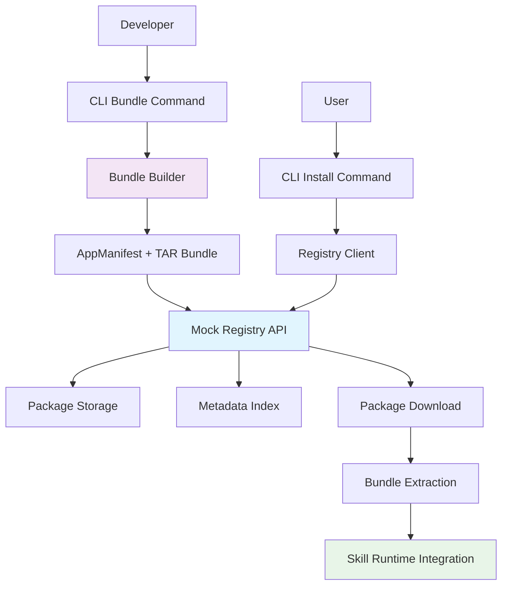

# WBS-17 Phase 3: Registry Mock & E2E Requirements

## Overview

This document outlines the requirements for Phase 3 of WBS-17: implementing a mock registry system for skill bundle distribution and end-to-end testing of the complete skill packaging and installation workflow.

## Background

- **Phase 1 Complete**: SkillRuntime architecture and progressive disclosure implemented (2025-10-20)
- **Phase 2 Complete**: AppManifest format and TAR bundle format designed (2025-10-20)
- **Phase 3 Goal**: Mock registry implementation with complete E2E workflow validation
- **Long-term Vision**: Prepare for production skill marketplace/registry

## System Architecture



## Core Requirements

### 1. Mock Registry Server

#### 1.1 Package Storage API
```typescript
interface RegistryStorageAPI {
  // Package upload
  uploadPackage(packageId: string, version: string, bundle: Buffer): Promise<UploadResult>;
  
  // Package download
  downloadPackage(packageId: string, version: string): Promise<Buffer>;
  getPackageVersions(packageId: string): Promise<string[]>;
  
  // Package management
  deletePackage(packageId: string, version: string): Promise<void>;
  packageExists(packageId: string, version: string): Promise<boolean>;
  
  // Package metadata
  getPackageSize(packageId: string, version: string): Promise<number>;
  getPackageChecksum(packageId: string, version: string): Promise<string>;
}
```

#### 1.2 Metadata Index API
```typescript
interface RegistryIndexAPI {
  // Package registration
  registerPackage(manifest: AppManifest): Promise<RegistrationResult>;
  updatePackage(packageId: string, version: string, manifest: AppManifest): Promise<void>;
  
  // Package discovery
  searchPackages(query: SearchQuery): Promise<SearchResult[]>;
  getPackageInfo(packageId: string, version?: string): Promise<PackageInfo>;
  listPackages(options?: ListOptions): Promise<PackageList>;
  
  // Dependency resolution
  resolveDependencies(dependencies: PackageDependency[]): Promise<ResolvedDependency[]>;
  getDependents(packageId: string): Promise<PackageReference[]>;
  
  // Statistics and analytics
  getDownloadStats(packageId: string, version?: string): Promise<DownloadStats>;
  getPopularPackages(limit?: number): Promise<PopularPackage[]>;
}
```

#### 1.3 Authentication & Authorization
```typescript
interface RegistryAuthAPI {
  // User authentication
  authenticateUser(credentials: UserCredentials): Promise<AuthToken>;
  refreshToken(token: string): Promise<AuthToken>;
  logoutUser(token: string): Promise<void>;
  
  // Authorization
  checkPermission(token: string, resource: string, action: string): Promise<boolean>;
  getUserInfo(token: string): Promise<UserInfo>;
  
  // API keys for automated access
  generateAPIKey(userId: string, permissions: string[]): Promise<APIKey>;
  revokeAPIKey(apiKey: string): Promise<void>;
  validateAPIKey(apiKey: string): Promise<APIKeyInfo>;
}
```

### 2. Registry Implementation

#### 2.1 In-Memory Mock Registry
```typescript
class MockRegistryServer implements RegistryStorageAPI, RegistryIndexAPI, RegistryAuthAPI {
  private packages: Map<string, Map<string, PackageData>> = new Map();
  private metadata: Map<string, PackageInfo[]> = new Map();
  private users: Map<string, UserData> = new Map();
  private apiKeys: Map<string, APIKeyData> = new Map();
  private downloadStats: Map<string, DownloadCount[]> = new Map();

  // Storage implementation
  async uploadPackage(packageId: string, version: string, bundle: Buffer): Promise<UploadResult> {
    // 1. Validate package format
    const validation = await this.validateBundle(bundle);
    if (!validation.valid) {
      throw new Error(`Invalid bundle: ${validation.errors.join(', ')}`);
    }
    
    // 2. Store package data
    if (!this.packages.has(packageId)) {
      this.packages.set(packageId, new Map());
    }
    
    const packageData: PackageData = {
      packageId,
      version,
      bundle,
      checksum: this.calculateChecksum(bundle),
      uploadedAt: new Date(),
      size: bundle.length
    };
    
    this.packages.get(packageId)!.set(version, packageData);
    
    // 3. Update download stats
    this.updateDownloadStats(packageId, version);
    
    return {
      packageId,
      version,
      size: bundle.length,
      checksum: packageData.checksum,
      uploadedAt: packageData.uploadedAt
    };
  }

  async downloadPackage(packageId: string, version: string): Promise<Buffer> {
    const packageVersions = this.packages.get(packageId);
    if (!packageVersions) {
      throw new Error(`Package ${packageId} not found`);
    }
    
    const packageData = packageVersions.get(version || 'latest');
    if (!packageData) {
      throw new Error(`Version ${version} of package ${packageId} not found`);
    }
    
    // Update download stats
    this.updateDownloadStats(packageId, version);
    
    return packageData.bundle;
  }

  // Index implementation
  async registerPackage(manifest: AppManifest): Promise<RegistrationResult> {
    // 1. Validate manifest
    const validation = await this.validateManifest(manifest);
    if (!validation.valid) {
      throw new Error(`Invalid manifest: ${validation.errors.join(', ')}`);
    }
    
    // 2. Extract search terms
    const searchTerms = this.extractSearchTerms(manifest);
    
    // 3. Store metadata
    const packageInfo: PackageInfo = {
      id: manifest.id,
      name: manifest.metadata.name,
      description: manifest.metadata.description,
      version: manifest.version,
      author: manifest.metadata.author,
      license: manifest.license,
      keywords: manifest.metadata.keywords,
      homepage: manifest.metadata.homepage,
      repository: manifest.metadata.repository,
      searchTerms,
      registeredAt: new Date(),
      updatedAt: new Date(),
      downloadCount: 0,
      dependencies: manifest.dependencies,
      runtimeRequirements: manifest.runtimeRequirements,
      compatibility: manifest.compatibility
    };
    
    if (!this.metadata.has(manifest.id)) {
      this.metadata.set(manifest.id, []);
    }
    
    this.metadata.get(manifest.id)!.push(packageInfo);
    
    return {
      packageId: manifest.id,
      version: manifest.version,
      registeredAt: packageInfo.registeredAt
    };
  }

  async searchPackages(query: SearchQuery): Promise<SearchResult[]> {
    const results: SearchResult[] = [];
    
    for (const [packageId, packageInfos] of this.metadata) {
      const latestInfo = packageInfos[packageInfos.length - 1];
      
      // Search relevance scoring
      const score = this.calculateRelevanceScore(latestInfo, query);
      if (score > 0) {
        results.push({
          packageId: latestInfo.id,
          name: latestInfo.name,
          description: latestInfo.description,
          version: latestInfo.version,
          author: latestInfo.author,
          keywords: latestInfo.keywords,
          downloadCount: latestInfo.downloadCount,
          updatedAt: latestInfo.updatedAt,
          score
        });
      }
    }
    
    // Sort by relevance score
    return results.sort((a, b) => b.score - a.score).slice(0, query.limit || 50);
  }
}
```

#### 2.2 HTTP API Server
```typescript
class RegistryHTTPServer {
  private registry: MockRegistryServer;
  private app: express.Express;
  private port: number;

  constructor(registry: MockRegistryServer, port: number = 3000) {
    this.registry = registry;
    this.port = port;
    this.app = express();
    this.setupRoutes();
  }

  private setupRoutes(): void {
    // Package routes
    this.app.post('/packages/:id/versions/:version', this.handleUpload.bind(this));
    this.app.get('/packages/:id/versions/:version/download', this.handleDownload.bind(this));
    this.app.get('/packages/:id/versions', this.handleListVersions.bind(this));
    this.app.delete('/packages/:id/versions/:version', this.handleDelete.bind(this));

    // Metadata routes
    this.app.post('/packages/register', this.handleRegister.bind(this));
    this.app.get('/packages/search', this.handleSearch.bind(this));
    this.app.get('/packages/:id', this.handleGetPackageInfo.bind(this));
    this.app.get('/packages', this.handleListPackages.bind(this));

    // Auth routes
    this.app.post('/auth/login', this.handleLogin.bind(this));
    this.app.post('/auth/refresh', this.handleRefresh.bind(this));
    this.app.post('/auth/logout', this.handleLogout.bind(this));

    // API key routes
    this.app.post('/api-keys', this.handleCreateAPIKey.bind(this));
    this.app.delete('/api-keys/:keyId', this.handleRevokeAPIKey.bind(this));

    // Health check
    this.app.get('/health', this.handleHealthCheck.bind(this));
  }

  async start(): Promise<void> {
    return new Promise((resolve) => {
      this.app.listen(this.port, () => {
        console.log(`Mock registry server running on port ${this.port}`);
        resolve();
      });
    });
  }

  async stop(): Promise<void> {
    return new Promise((resolve) => {
      this.server.close(() => {
        console.log('Mock registry server stopped');
        resolve();
      });
    });
  }
}
```

### 3. CLI Registry Integration

#### 3.1 Registry Client
```typescript
interface RegistryClient {
  // Authentication
  login(registryUrl: string, credentials: UserCredentials): Promise<LoginResult>;
  logout(registryUrl: string): Promise<void>;
  isLoggedIn(registryUrl: string): Promise<boolean>;
  
  // Package operations
  publish(bundlePath: string, registryUrl: string): Promise<PublishResult>;
  install(packageId: string, version?: string, registryUrl?: string): Promise<InstallResult>;
  uninstall(packageId: string, version?: string): Promise<UninstallResult>;
  
  // Discovery
  search(query: string, registryUrl?: string): Promise<SearchResult[]>;
  info(packageId: string, version?: string, registryUrl?: string): Promise<PackageInfo>;
  list(registryUrl?: string): Promise<PackageList>;
  
  // Configuration
  addRegistry(url: string, name?: string): Promise<void>;
  removeRegistry(name: string): Promise<void>;
  listRegistries(): Promise<RegistryConfig[]>;
  setDefaultRegistry(name: string): Promise<void>;
}

class CrewxRegistryClient implements RegistryClient {
  private config: RegistryConfig;
  private authToken?: string;

  constructor(config: RegistryConfig) {
    this.config = config;
  }

  async login(registryUrl: string, credentials: UserCredentials): Promise<LoginResult> {
    const response = await fetch(`${registryUrl}/auth/login`, {
      method: 'POST',
      headers: { 'Content-Type': 'application/json' },
      body: JSON.stringify(credentials)
    });

    if (!response.ok) {
      throw new Error(`Login failed: ${response.statusText}`);
    }

    const authData: AuthToken = await response.json();
    this.authToken = authData.token;
    
    // Store token securely
    await this.storeAuthToken(registryUrl, authData);
    
    return {
      registryUrl,
      user: authData.user,
      expiresAt: new Date(authData.expiresAt)
    };
  }

  async publish(bundlePath: string, registryUrl: string): Promise<PublishResult> {
    // 1. Validate bundle
    const bundleBuffer = await fs.readFile(bundlePath);
    const validation = await this.validateBundle(bundleBuffer);
    if (!validation.valid) {
      throw new Error(`Bundle validation failed: ${validation.errors.join(', ')}`);
    }

    // 2. Extract manifest
    const manifest = await this.extractManifest(bundleBuffer);
    
    // 3. Check authentication
    if (!this.authToken) {
      throw new Error('Not authenticated. Please run "crewx registry login" first.');
    }

    // 4. Upload bundle
    const uploadResponse = await fetch(`${registryUrl}/packages/${manifest.id}/versions/${manifest.version}`, {
      method: 'POST',
      headers: {
        'Authorization': `Bearer ${this.authToken}`,
        'Content-Type': 'application/octet-stream'
      },
      body: bundleBuffer
    });

    if (!uploadResponse.ok) {
      throw new Error(`Upload failed: ${uploadResponse.statusText}`);
    }

    // 5. Register metadata
    const registerResponse = await fetch(`${registryUrl}/packages/register`, {
      method: 'POST',
      headers: {
        'Authorization': `Bearer ${this.authToken}`,
        'Content-Type': 'application/json'
      },
      body: JSON.stringify(manifest)
    });

    if (!registerResponse.ok) {
      throw new Error(`Registration failed: ${registerResponse.statusText}`);
    }

    return {
      packageId: manifest.id,
      version: manifest.version,
      registryUrl,
      publishedAt: new Date()
    };
  }

  async install(packageId: string, version?: string, registryUrl?: string): Promise<InstallResult> {
    const targetRegistry = registryUrl || this.config.defaultRegistry;
    if (!targetRegistry) {
      throw new Error('No registry URL specified and no default registry configured');
    }

    // 1. Get package info
    const packageInfo = await this.info(packageId, version, targetRegistry);
    
    // 2. Resolve dependencies
    const dependencies = await this.resolveDependencies(packageInfo.dependencies);
    
    // 3. Install dependencies first
    for (const dep of dependencies) {
      await this.install(dep.packageId, dep.version, targetRegistry);
    }

    // 4. Download package
    const downloadUrl = `${targetRegistry}/packages/${packageId}/versions/${version || packageInfo.version}/download`;
    const response = await fetch(downloadUrl);
    
    if (!response.ok) {
      throw new Error(`Download failed: ${response.statusText}`);
    }

    const bundleBuffer = Buffer.from(await response.arrayBuffer());
    
    // 5. Extract bundle
    const installPath = path.join(process.cwd(), 'node_modules', '.crewx', 'skills', packageId);
    await this.extractBundle(bundleBuffer, installPath);
    
    // 6. Update local registry
    await this.updateLocalRegistry(packageId, packageInfo, installPath);

    return {
      packageId,
      version: version || packageInfo.version,
      installPath,
      registryUrl: targetRegistry,
      dependenciesInstalled: dependencies.length,
      installedAt: new Date()
    };
  }
}
```

#### 3.2 CLI Commands Integration
```typescript
// CLI Command: crewx registry publish
export class RegistryPublishHandler {
  constructor(
    private readonly registryClient: RegistryClient,
    private readonly bundleBuilder: BundleBuilder
  ) {}

  async handle(args: PublishArgs): Promise<void> {
    try {
      // 1. Determine bundle path
      let bundlePath = args.bundle;
      if (!bundlePath) {
        // Create bundle from current directory
        const result = await this.bundleBuilder.createBundleFromDirectory(process.cwd(), {
          id: args.id,
          version: args.version,
          name: args.name,
          description: args.description
        });
        bundlePath = result.bundlePath;
      }

      // 2. Validate bundle
      const validation = await this.bundleBuilder.validateBundle(bundlePath);
      if (!validation.valid) {
        console.error('❌ Bundle validation failed:');
        validation.errors.forEach(error => console.error(`  - ${error}`));
        process.exit(1);
      }

      if (validation.warnings.length > 0) {
        console.warn('⚠️  Bundle validation warnings:');
        validation.warnings.forEach(warning => console.warn(`  - ${warning}`));
      }

      // 3. Publish to registry
      console.log(`📦 Publishing ${bundlePath} to ${args.registry || 'default registry'}...`);
      const result = await this.registryClient.publish(bundlePath, args.registry);
      
      console.log('✅ Package published successfully!');
      console.log(`   Package: ${result.packageId}@${result.version}`);
      console.log(`   Registry: ${result.registryUrl}`);
      console.log(`   Published: ${result.publishedAt.toISOString()}`);
      
    } catch (error) {
      console.error('❌ Publish failed:', (error as Error).message);
      process.exit(1);
    }
  }
}

// CLI Command: crewx registry install
export class RegistryInstallHandler {
  constructor(private readonly registryClient: RegistryClient) {}

  async handle(args: InstallArgs): Promise<void> {
    try {
      console.log(`📦 Installing ${args.package}${args.version ? `@${args.version}` : ''}...`);
      
      const result = await this.registryClient.install(args.package, args.version, args.registry);
      
      console.log('✅ Package installed successfully!');
      console.log(`   Package: ${result.packageId}@${result.version}`);
      console.log(`   Location: ${result.installPath}`);
      console.log(`   Registry: ${result.registryUrl}`);
      
      if (result.dependenciesInstalled > 0) {
        console.log(`   Dependencies: ${result.dependenciesInstalled} packages installed`);
      }
      
    } catch (error) {
      console.error('❌ Install failed:', (error as Error).message);
      process.exit(1);
    }
  }
}
```

### 4. End-to-End Test Scenarios

#### 4.1 Package Creation and Publishing
```typescript
describe('E2E: Package Creation and Publishing', () => {
  let registryServer: MockRegistryServer;
  let httpClient: RegistryHTTPServer;
  let registryClient: RegistryClient;
  let bundleBuilder: BundleBuilder;

  beforeAll(async () => {
    registryServer = new MockRegistryServer();
    httpClient = new RegistryHTTPServer(registryServer, 0); // Random port
    await httpClient.start();
    
    const registryUrl = `http://localhost:${httpClient.getPort()}`;
    registryClient = new CrewxRegistryClient({ defaultRegistry: registryUrl });
    bundleBuilder = new TarBundleBuilder();
  });

  afterAll(async () => {
    await httpClient.stop();
  });

  test('should create bundle from skills directory and publish to registry', async () => {
    // 1. Create test skills directory
    const skillsDir = await createTestSkillsDirectory();
    
    // 2. Create bundle
    const bundleResult = await bundleBuilder.createBundleFromDirectory(skillsDir, {
      id: 'test-skills',
      version: '1.0.0',
      name: 'Test Skills',
      description: 'A collection of test skills for E2E testing',
      author: {
        name: 'Test Author',
        email: 'test@example.com'
      }
    });

    // 3. Validate bundle
    const validation = await bundleBuilder.validateBundle(bundleResult.bundlePath);
    expect(validation.valid).toBe(true);
    expect(validation.errors).toHaveLength(0);

    // 4. Login to registry
    await registryClient.login(registryClient.config.defaultRegistry, {
      username: 'testuser',
      password: 'testpass'
    });

    // 5. Publish to registry
    const publishResult = await registryClient.publish(bundleResult.bundlePath);
    
    expect(publishResult.packageId).toBe('test-skills');
    expect(publishResult.version).toBe('1.0.0');

    // 6. Verify package exists in registry
    const packageInfo = await registryClient.info('test-skills', '1.0.0');
    expect(packageInfo.id).toBe('test-skills');
    expect(packageInfo.version).toBe('1.0.0');
    expect(packageInfo.name).toBe('Test Skills');

    // Cleanup
    await fs.rm(bundleResult.bundlePath, { force: true });
    await fs.rm(skillsDir, { recursive: true, force: true });
  });
});
```

#### 4.2 Package Discovery and Installation
```typescript
describe('E2E: Package Discovery and Installation', () => {
  test('should search, discover, and install packages with dependencies', async () => {
    // 1. Setup registry with test packages
    await setupTestPackages();
    
    // 2. Search for packages
    const searchResults = await registryClient.search('data analysis');
    expect(searchResults.length).toBeGreaterThan(0);
    
    const dataAnalysisPackage = searchResults.find(p => p.name.includes('Data Analysis'));
    expect(dataAnalysisPackage).toBeDefined();
    
    // 3. Get detailed package info
    const packageInfo = await registryClient.info(dataAnalysisPackage!.packageId);
    expect(packageInfo.dependencies).toBeDefined();
    
    // 4. Install package
    const installResult = await registryClient.install(dataAnalysisPackage!.packageId);
    expect(installResult.packageId).toBe(dataAnalysisPackage!.packageId);
    expect(installResult.dependenciesInstalled).toBeGreaterThan(0);
    
    // 5. Verify installation
    const installPath = path.join(process.cwd(), 'node_modules', '.crewx', 'skills', dataAnalysisPackage!.packageId);
    expect(await fs.pathExists(installPath)).toBe(true);
    
    // 6. Verify manifest exists
    const manifestPath = path.join(installPath, 'manifest.json');
    expect(await fs.pathExists(manifestPath)).toBe(true);
    
    const manifest = JSON.parse(await fs.readFile(manifestPath, 'utf8'));
    expect(manifest.id).toBe(dataAnalysisPackage!.packageId);
    
    // 7. Verify skills are accessible by runtime
    const skillRuntime = new SkillRuntime(/* dependencies */);
    const skills = await skillRuntime.loadSkills({
      searchPaths: [installPath]
    });
    expect(skills.length).toBeGreaterThan(0);
  });
});
```

#### 4.3 Runtime Integration
```typescript
describe('E2E: Runtime Integration', () => {
  test('should execute installed skill from registry package', async () => {
    // 1. Install skill package
    await registryClient.install('code-formatter', '1.2.0');
    
    // 2. Setup skill runtime with installed skills path
    const skillsPath = path.join(process.cwd(), 'node_modules', '.crewx', 'skills');
    const skillRuntime = new SkillRuntime(/* dependencies */);
    
    // 3. Load installed skills
    const skills = await skillRuntime.loadSkills({
      searchPaths: [skillsPath]
    });
    expect(skills.some(s => s.name === 'code-formatter')).toBe(true);
    
    // 4. Prepare execution context
    const agentConfig = createMockAgentConfig();
    const context = await skillRuntime.prepareContext('code-formatter', agentConfig);
    
    // 5. Execute skill
    const result = await skillRuntime.executeSkill(context, 'format this javascript code');
    
    expect(result.success).toBe(true);
    expect(result.output).toBeDefined();
    expect(result.metadata.dependenciesUsed).toContain('code-formatter');
  });
});
```

#### 4.4 Dependency Resolution
```typescript
describe('E2E: Dependency Resolution', () => {
  test('should resolve and install complex dependency chains', async () => {
    // Setup packages with complex dependencies:
    // - data-analysis-tools (depends on python-data-libs@1.5.0)
    // - python-data-libs (depends on python-base@2.0.0)
    // - python-base (no dependencies)
    
    await setupComplexDependencies();
    
    // Install top-level package
    const installResult = await registryClient.install('data-analysis-tools');
    
    // Verify all dependencies are installed
    const installedPackages = await getInstalledPackages();
    expect(installedPackages).toContain('data-analysis-tools');
    expect(installedPackages).toContain('python-data-libs');
    expect(installedPackages).toContain('python-base');
    
    // Verify correct versions
    const installedVersions = await getInstalledVersions();
    expect(installedVersions['python-data-libs']).toMatch(/^1\.5\./);
    expect(installedVersions['python-base']).toMatch(/^2\.0\./);
  });

  test('should handle dependency conflicts gracefully', async () => {
    // Setup conflicting packages:
    // - package-a (depends on shared-lib@1.0.0)
    // - package-b (depends on shared-lib@2.0.0)
    
    await setupConflictingDependencies();
    
    // Install first package
    await registryClient.install('package-a');
    
    // Attempt to install conflicting package
    await expect(
      registryClient.install('package-b')
    ).rejects.toThrow(/dependency conflict/);
  });
});
```

### 5. Performance and Scalability Requirements

#### 5.1 Performance Benchmarks
```typescript
interface PerformanceBenchmark {
  bundleCreationTime: number; // ms for 10 skills bundle
  bundleSize: number; // bytes for compressed bundle
  uploadTime: number; // ms for 1MB bundle upload
  downloadTime: number; // ms for 1MB bundle download
  searchTime: number; // ms for 1000 package search
  installTime: number; // ms for 10 skill package install
}

describe('Performance Benchmarks', () => {
  test('should meet performance requirements', async () => {
    const benchmark: PerformanceBenchmark = await runPerformanceBenchmarks();
    
    expect(benchmark.bundleCreationTime).toBeLessThan(5000); // 5s
    expect(benchmark.bundleSize).toBeLessThan(1024 * 1024); // 1MB
    expect(benchmark.uploadTime).toBeLessThan(3000); // 3s
    expect(benchmark.downloadTime).toBeLessThan(2000); // 2s
    expect(benchmark.searchTime).toBeLessThan(500); // 500ms
    expect(benchmark.installTime).toBeLessThan(10000); // 10s
  });
});
```

#### 5.2 Concurrent Operations
```typescript
describe('Concurrent Operations', () => {
  test('should handle multiple concurrent uploads', async () => {
    const uploadPromises = Array.from({ length: 10 }, (_, i) =>
      registryClient.publish(`test-package-${i}`, `1.0.0`)
    );
    
    const results = await Promise.all(uploadPromises);
    expect(results).toHaveLength(10);
    
    // Verify all packages are registered
    for (const result of results) {
      const packageInfo = await registryClient.info(result.packageId, result.version);
      expect(packageInfo).toBeDefined();
    }
  });

  test('should handle multiple concurrent downloads', async () => {
    // Setup test packages
    await setupTestPackages(50);
    
    const downloadPromises = Array.from({ length: 50 }, (_, i) =>
      registryClient.install(`test-package-${i}`, `1.0.0`)
    );
    
    const results = await Promise.all(downloadPromises);
    expect(results).toHaveLength(50);
    
    // Verify all installations succeeded
    for (const result of results) {
      expect(await fs.pathExists(result.installPath)).toBe(true);
    }
  });
});
```

## Implementation Tasks

### Phase 3 Implementation Steps

#### Week 1: Core Registry Server
- [ ] MockRegistryServer implementation with in-memory storage
- [ ] HTTP API server with Express.js
- [ ] Basic authentication and authorization
- [ ] Package upload and download endpoints
- [ ] Metadata registration and search

#### Week 2: Registry Client and CLI Integration
- [ ] RegistryClient implementation with full API coverage
- [ ] CLI registry commands (login, publish, install, search, info)
- [ ] Configuration management for multiple registries
- [ ] Error handling and retry logic
- [ ] Progress indicators for large operations

#### Week 3: End-to-End Testing
- [ ] Comprehensive E2E test suite
- [ ] Performance benchmarking
- [ ] Concurrent operation testing
- [ ] Error scenario testing
- [ ] Integration with existing SkillRuntime

#### Week 4: Documentation and Polish
- [ ] User documentation and guides
- [ ] API documentation
- [ ] Performance optimization
- [ ] Security review and hardening
- [ ] Production readiness checklist

### Success Criteria

#### Functional Requirements
- ✅ Complete mock registry implementation
- ✅ Full CLI integration with registry operations
- ✅ End-to-end workflow validation (bundle → publish → install → execute)
- ✅ Dependency resolution and conflict handling
- ✅ Authentication and authorization

#### Non-Functional Requirements
- ✅ Performance benchmarks met
- ✅ Concurrent operation support
- ✅ Error handling and recovery
- ✅ Security best practices
- ✅ Comprehensive test coverage (>90%)

#### Integration Requirements
- ✅ Seamless integration with existing SkillRuntime
- ✅ Backward compatibility with skills/ directory
- ✅ Support for existing agent configurations
- ✅ CLI command consistency

## Risk Assessment

### Technical Risks
| Risk | Impact | Probability | Mitigation |
|------|--------|-------------|------------|
| Performance bottlenecks in mock registry | Medium | Medium | Async operations, connection pooling, caching |
| Concurrent operation conflicts | High | Low | Proper locking, transaction handling, idempotency |
| Authentication token management | High | Low | Secure token storage, refresh mechanisms |
| Bundle format compatibility issues | Medium | Low | Version validation, migration support |

### Integration Risks
| Risk | Impact | Probability | Mitigation |
|------|--------|-------------|------------|
| SkillRuntime integration complexity | High | Medium | Careful interface design, adapter pattern |
| CLI command conflicts | Medium | Low | Command namespace separation, deprecation paths |
| Backward compatibility breakage | High | Medium | Migration tools, feature flags |

## Future Considerations

### Production Registry Migration
The mock registry design provides a solid foundation for production registry implementation:

1. **Storage Layer**: Replace in-memory with database (PostgreSQL/MongoDB)
2. **File Storage**: Replace local storage with cloud storage (S3/GCS)
3. **Authentication**: Integrate with OAuth providers
4. **CDN Integration**: Add CDN for package distribution
5. **Analytics**: Implement usage tracking and metrics
6. **Rate Limiting**: Add API rate limiting and quota management

### Security Enhancements
1. **Package Signing**: Implement GPG-based package signing
2. **Vulnerability Scanning**: Automated security scanning of packages
3. **Access Control**: Fine-grained permissions and roles
4. **Audit Logging**: Comprehensive audit trail for all operations

### Ecosystem Features
1. **Package Reviews**: User rating and review system
2. **Verified Publishers**: Publisher verification badges
3. **Dependency Graph Visualization**: Interactive dependency exploration
4. **Automated Testing**: CI/CD integration for package testing

---

## Summary

WBS-17 Phase 3 establishes a comprehensive mock registry system that validates the complete skill packaging and distribution workflow:

- **Mock Registry Server**: Full-featured in-memory registry with HTTP API
- **CLI Integration**: Seamless registry operations through CrewX CLI
- **End-to-End Testing**: Comprehensive validation of the entire workflow
- **Performance Validation**: Benchmarks and scalability testing
- **Production Foundation**: Clear migration path to production registry

The implementation provides a solid foundation for the long-term vision of a CrewX skill marketplace and ecosystem, while ensuring backward compatibility and smooth integration with existing systems.